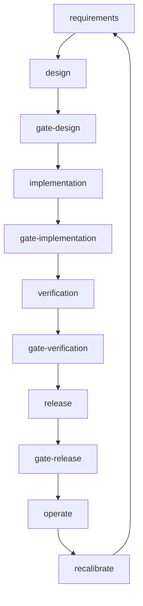
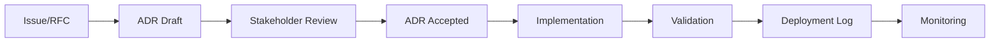
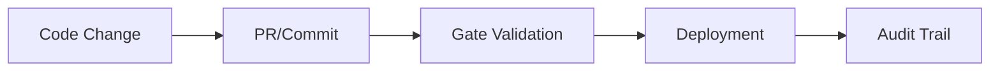

# MaintAInPro Traceability Framework

## Overview

The MaintAInPro Traceability Framework ensures complete audit trails, compliance, and accountability across the entire software development lifecycle. This framework integrates Architecture Decision Records (ADRs), quality gates, process governance, and deployment tracking to provide comprehensive visibility into all changes, decisions, and operations.

## Purpose

This documentation provides:

- **Compliance Support**: Complete audit trails for regulatory requirements and internal governance
- **Onboarding Guide**: Clear understanding of traceability processes for new team members  
- **Decision Tracking**: How architectural and process decisions are recorded and linked
- **Quality Assurance**: Evidence-based gates and validation processes
- **Incident Response**: Rapid identification of changes, decisions, and deployments for troubleshooting

---

## Core Components

### 1. Architecture Decision Records (ADRs)

ADRs document all significant architectural and process decisions with full context and rationale.

#### Location & Structure
- **Template**: [`artifacts/adr/ADR_TEMPLATE.md`](../../artifacts/adr/ADR_TEMPLATE.md)
- **Repository**: `artifacts/adr/` directory
- **Examples**: [`Documentation/Blueprint/adr-drizzle-orm.md`](../adr-drizzle-orm.md)

#### ADR Process
1. **Creation**: Use the ADR template for all significant decisions
2. **Review**: Decisions are reviewed and approved by stakeholders
3. **Linking**: ADRs reference related RFCs, requirements, and threat models
4. **Status Tracking**: Each ADR has a clear status (proposed, accepted, superseded, rejected)
5. **Evidence**: Include supporting evidence like performance reports, cost models, or benchmarks

#### ADR Content Requirements
- **Context**: Background, goals, and constraints
- **Options**: Alternatives considered with pros/cons
- **Decision**: Chosen option with clear justification
- **Consequences**: Implications, trade-offs, and follow-up work
- **Evidence**: Supporting data, reports, or analysis
- **Reconsideration Triggers**: Conditions that would warrant revisiting the decision

### 2. Process Graph & Workflow

The process graph defines the complete software development lifecycle with mandatory phases and decision points.

#### Graph Definition
- **Source**: [`.process/graph.yaml`](../../.process/graph.yaml)
- **Visualization**: Auto-generated Mermaid diagrams
- **Validation**: [`ci/validate_graph.py`](../../ci/validate_graph.py)

#### Workflow Phases

#### Phase Details
- **Requirements**: Define functional and non-functional requirements
- **Design**: Create architectural designs, threat models, and compliance documentation  
- **Implementation**: Develop code with proper testing and documentation
- **Verification**: Conduct performance testing, security scanning, and audit validation
- **Release**: Deploy with staged rollouts and monitoring
- **Operate**: Monitor performance, handle incidents, collect feedback
- **Recalibrate**: Analyze outcomes, update processes, plan improvements

### 3. Quality Gates

Quality gates enforce evidence-based decision making and ensure all criteria are met before proceeding to the next phase.

#### Gate Validation
- **Script**: [`ci/check_gates.py`](../../ci/check_gates.py)
- **Policies**: [`.process/policies/`](../../.process/policies/)
- **Evidence**: Required artifacts and documentation for each gate

#### Gate Requirements

##### Design Gate (`gate-design`)
**Criteria:**
- Threat model completed
- Privacy and compliance sign-off  
- NFRs documented

**Evidence:**
- [`artifacts/threat/THREAT_TEMPLATE.md`](../../artifacts/threat/THREAT_TEMPLATE.md)
- [`requirements/privacy.yml`](../../requirements/privacy.yml)
- [`requirements/compliance.yml`](../../requirements/compliance.yml)
- [`requirements/nfr.yml`](../../requirements/nfr.yml)

##### Implementation Gate (`gate-implementation`)
**Criteria:**
- Code reviewed
- Unit/integration tests pass
- Coverage ≥ 80%
- Mutation score ≥ 70%

**Evidence:**
- `evidence/test results`
- `evidence/coverage report`
- `evidence/mutation report`

##### Verification Gate (`gate-verification`)
**Criteria:**
- Performance tests pass
- Security scan clean
- Audit logging enabled

**Evidence:**
- `evidence/performance report`
- `evidence/SARIF report`
- `evidence/audit log config`

##### Release Gate (`gate-release`)
**Criteria:**
- Canary/staged rollout
- Rollback plan in place
- Post-release monitoring

**Evidence:**
- `evidence/rollout plan`
- `evidence/monitoring config`
- `evidence/postmortem template`

### 4. Deployment Traceability

Complete tracking of all production deployments with metadata for auditing and incident response.

#### Deployment Log
- **Location**: [`Deployments.md`](./Deployments.md)
- **Automation**: [`scripts/setup/update-deployments.js`](../../scripts/setup/update-deployments.js)
- **Format**: Structured table with all deployment metadata

#### Tracked Information
- **Temporal**: UTC and local timestamps
- **Source**: Actor, git SHA, PR/Issue numbers
- **Deployment**: Unique ID, production URL, health status
- **Recovery**: Rollback actions and incident response
- **Features**: Feature flag configurations
- **Process**: Links to process graph phase

---

## Traceability Workflows

### 1. Decision Tracking Workflow

1. **Issue/RFC**: Problem or opportunity identified
2. **ADR Draft**: Create ADR using template with options analysis
3. **Stakeholder Review**: Review decision with relevant teams
4. **ADR Accepted**: Decision approved and status updated
5. **Implementation**: Code changes linked to ADR
6. **Validation**: Gate evidence validates implementation
7. **Deployment Log**: Changes tracked in deployment history
8. **Monitoring**: Post-deployment monitoring and feedback

### 2. Change Traceability Workflow

1. **Code Change**: All changes linked to issues or ADRs
2. **PR/Commit**: Conventional commit messages with traceability
3. **Gate Validation**: Required evidence and criteria checked
4. **Deployment**: Automated deployment log entry
5. **Audit Trail**: Complete history for compliance and debugging

### 3. Incident Response Traceability

When issues occur in production:

1. **Check Deployment Log**: Identify recent changes and deployments
2. **Review ADRs**: Understand architectural decisions affecting the area
3. **Validate Gates**: Confirm required evidence was provided
4. **Analyze Process**: Identify process improvements needed
5. **Update Documentation**: Record lessons learned and improvements

---

## Compliance Integration

### Regulatory Requirements

The traceability framework supports compliance with:

- **SOC 2**: Audit trails for all system changes and access
- **GDPR**: Privacy impact documentation and data processing records
- **Industry Standards**: Evidence-based quality management
- **Internal Governance**: Architectural decision documentation

### Evidence Management

- **ADRs**: Architectural decisions with full context and justification
- **Gate Evidence**: Required artifacts for each development phase
- **Deployment Logs**: Complete history of all production changes
- **Test Results**: Coverage, performance, and security validation
- **Monitoring**: Post-deployment health and performance data

### Audit Support

The framework provides auditors with:

- **Decision Context**: Why specific architectural choices were made
- **Change History**: Complete timeline of all modifications
- **Quality Evidence**: Test results, coverage, and security scans
- **Incident Response**: How issues were identified and resolved
- **Process Compliance**: Evidence that required procedures were followed

---

## Tools & Automation

### CI/CD Integration

- **Gate Validation**: [`ci/check_gates.py`](../../ci/check_gates.py) - Validates all required evidence
- **Graph Validation**: [`ci/validate_graph.py`](../../ci/validate_graph.py) - Ensures process integrity
- **Diagram Generation**: [`ci/render_diagrams.py`](../../ci/render_diagrams.py) - Creates visual documentation

### Deployment Automation

- **Log Updates**: [`scripts/setup/update-deployments.js`](../../scripts/setup/update-deployments.js)
- **Metadata Extraction**: Git history, PR links, feature flags
- **Health Monitoring**: Post-deployment validation and status

### Documentation Tools

- **ADR Templates**: Standardized decision documentation format
- **Process Graphs**: Visual workflow representation
- **Mermaid Diagrams**: Auto-generated process visualization

---

## Best Practices

### For ADRs
- **Scope Decisions Appropriately**: Focus on significant architectural choices
- **Include Context**: Explain the problem and constraints
- **Consider Alternatives**: Document options considered and why they were rejected
- **Provide Evidence**: Include supporting data, benchmarks, or analysis
- **Cross-Reference**: Link to related RFCs, requirements, and threat models
- **Update Status**: Keep ADR status current (proposed → accepted → superseded)

### For Gates
- **Document Evidence**: Ensure all required artifacts are present and accessible
- **Automate Validation**: Use CI scripts to check gate requirements
- **Review Regularly**: Periodically assess if gate criteria are still appropriate
- **Update Process**: Incorporate lessons learned into gate requirements

### For Deployment Tracking
- **Automate Logging**: Use scripts to ensure consistent deployment records
- **Include Metadata**: Capture all relevant context for future reference
- **Monitor Health**: Track post-deployment status and performance
- **Plan Rollbacks**: Document rollback procedures and triggers

---

## Getting Started

### For New Team Members

1. **Read this Document**: Understand the overall traceability framework
2. **Review ADR Template**: [`artifacts/adr/ADR_TEMPLATE.md`](../../artifacts/adr/ADR_TEMPLATE.md)
3. **Examine Examples**: Study existing ADRs and deployment logs
4. **Understand Gates**: Review gate requirements and evidence types
5. **Practice with Tools**: Run CI validation scripts locally

### For Decision Making

1. **Create ADR**: Use template for significant decisions
2. **Gather Evidence**: Include supporting data and analysis
3. **Review with Stakeholders**: Get appropriate sign-off
4. **Link to Implementation**: Connect ADRs to code changes
5. **Validate Gates**: Ensure all evidence requirements are met

### For Incident Response

1. **Check Recent Deployments**: Review deployment log for changes
2. **Identify Related ADRs**: Find architectural decisions affecting the area
3. **Validate Process**: Confirm gates were properly satisfied
4. **Document Improvements**: Update process based on lessons learned

---

## References

### Documentation
- **Architecture Overview**: [`docs/architecture/README.md`](../../docs/architecture/README.md)
- **Decision Records**: [`docs/decisions/README.md`](../../docs/decisions/README.md)
- **Vision & Goals**: [`docs/vision.md`](../../docs/vision.md)
- **Discovery Process**: [`docs/discovery.md`](../../docs/discovery.md)

### Process Assets
- **Process Graph**: [`.process/graph.yaml`](../../.process/graph.yaml)
- **Gate Policies**: [`.process/policies/`](../../.process/policies/)
- **CI Validation**: [`ci/`](../../ci/) directory

### Templates & Examples
- **ADR Template**: [`artifacts/adr/ADR_TEMPLATE.md`](../../artifacts/adr/ADR_TEMPLATE.md)
- **Drizzle ORM ADR**: [`Documentation/Blueprint/adr-drizzle-orm.md`](../adr-drizzle-orm.md)
- **Deployment Log**: [`Deployments.md`](./Deployments.md)

### Compliance
- **Requirements**: [`requirements/`](../../requirements/) directory
- **Privacy Policy**: [`requirements/privacy.yml`](../../requirements/privacy.yml)
- **Compliance Framework**: [`requirements/compliance.yml`](../../requirements/compliance.yml)
- **Compliance Runbook**: [`runbooks/compliance_recordkeeping.md`](../../runbooks/compliance_recordkeeping.md)

---

*Last Updated: 2025-01-21*  
*Maintained by: MaintAInPro Development Team*