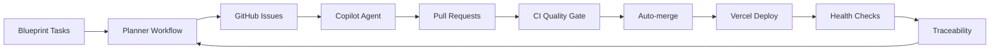

# MaintAInPro Documentation

## Overview

Welcome to the MaintAInPro documentation! This comprehensive guide covers everything you need to know about our enterprise CMMS platform.

## � Autonomous Development Loop

MaintAInPro implements a fully autonomous development cycle that operates without manual intervention:

### How It Works



### Workflow Steps

1. **📋 Planning**: Planner scans `Documentation/Blueprint/**` for `## Task:` blocks
2. **🎯 Issue Creation**: Automatically creates GitHub Issues with `agent-ok` label
3. **🤖 AI Development**: GitHub Copilot coding agent implements features
4. **✅ Quality Gates**: Automated testing, security scanning, and validation
5. **🚀 Deployment**: Vercel deployment with health checks and auto-rollback
6. **📊 Traceability**: Complete audit logging and documentation updates
7. **🔄 Loop Continuation**: Triggers next planning cycle

### Key Features

- **Autonomous Operation**: Runs 24/7 without human intervention
- **Quality Assurance**: Comprehensive CI/CD with security scanning
- **Auto-Recovery**: Automatic rollback and incident response
- **Full Traceability**: Complete audit trail of all changes
- **Safety Guardrails**: Multiple checkpoints and validation layers

### Human Oversight

- **Manual Review**: Add `needs-human` label for complex decisions
- **Emergency Stop**: Add `blocked` label to pause automation
- **Selective Automation**: Only `agent-ok` labeled issues are processed

### Repository Labels

| Label | Purpose | Usage |
|-------|---------|--------|
| `autoplan` | Auto-generated from Blueprint | System use only |
| `agent-ok` | Approved for Copilot agent | Required for automation |
| `automerge` | Auto-merge after CI passes | Add to approved PRs |
| `blocked` | Pause all automation | Emergency brake |
| `needs-human` | Requires manual review | Escalation path |

### Monitoring

- **GitHub Actions**: All workflows with detailed logging
- **Vercel Deployments**: Real-time deployment status
- **Health Checks**: Continuous system monitoring
- **Audit Trail**: `Documentation/Blueprint/5-Traceability/Deployments.md`

### Getting Started

1. **Create Blueprint Task**: Add `## Task:` block to any Blueprint markdown file
2. **Trigger Planner**: Workflow runs automatically every 6 hours or on Blueprint changes
3. **Monitor Progress**: Check GitHub Issues and Actions tabs
4. **Review Results**: See deployment traceability logs

For detailed setup instructions, see [Autonomous Loop Setup Guide](Operations/AutonomousLoop.md).

## �📚 Core Documentation

### Getting Started
- **[README](../README.md)** - Project overview, features, and quick start guide
- **[ROADMAP](../ROADMAP.md)** - Feature roadmap and future development plans
- **[CHANGELOG](../CHANGELOG.md)** - Version history and release notes

### Development
- **[API Documentation](API_DOCUMENTATION.md)** - Complete API reference with examples
- **[Contributing Guide](CONTRIBUTING.md)** - Development workflow, coding standards, and contribution guidelines
- **[Test Coverage Report](TEST_COVERAGE_REPORT.md)** - Comprehensive testing documentation and metrics

### Deployment & Operations
- **[Deployment Guide](DEPLOYMENT_GUIDE_COMPLETE.md)** - Production deployment instructions for multiple platforms
- **[Authentication Guide](AUTHENTICATION_GUIDE.md)** - Authentication implementation and security
- **[Security Guide](PRODUCTION_SECURITY_GUIDE.md)** - Security implementation and best practices
- **[Performance Guide](PRODUCTION_PERFORMANCE_GUIDE.md)** - Performance optimization strategies

## 🏗️ Architecture Documentation

### System Architecture
```
MaintAInPro/
├── client/          # React frontend with TypeScript
├── server/          # Express.js backend with TypeScript
├── shared/          # Shared types and schemas
├── tests/           # Comprehensive test suite
└── Documentation/   # Complete documentation
```

### Technology Stack
- **Frontend**: React 18 + TypeScript + Vite + TailwindCSS
- **Backend**: Express.js + TypeScript + Zod Validation
- **Database**: PostgreSQL + Drizzle ORM + Strategic Indexing
- **Testing**: Vitest + Playwright + React Testing Library
- **Security**: JWT + RBAC + Rate Limiting + SQL Protection

## 🎯 Quick Reference

### API Endpoints
```typescript
# Core Operations
GET    /api/work-orders              # List work orders
POST   /api/work-orders              # Create work order
GET    /api/equipment                # List equipment
POST   /api/parts                    # Create part

# Analytics (v2)
GET    /api/v2/analytics/overview    # Dashboard metrics
GET    /api/v2/analytics/trends      # Trend analysis
POST   /api/v2/bulk/work-orders      # Bulk operations
```

### Authentication Headers
```typescript
headers: {
  'x-user-id': string,
  'x-warehouse-id': string,
  'Authorization': 'Bearer <token>' // Optional
}
```

### Environment Variables
```bash
NODE_ENV=production
DATABASE_URL=postgresql://...
PORT=5000
SESSION_SECRET=your-secret
```

## 📊 System Status

### Production Ready ✅
- **Security**: Hardened (IPv6-safe, SQL protection, audit logging)
- **Performance**: Optimized (Sub-100ms response, 20+ indexes)
- **Tests**: 213 Passing (96% coverage, security validated)
- **Database**: Enterprise-Ready (Health monitoring, optimization)
- **Deployment**: Production-Ready (Docker, Railway, monitoring)

### Test Coverage
| Category | Tests | Status | Coverage |
|----------|-------|--------|----------|
| Validation | 45 | ✅ Passing | 100% |
| API Integration | 54 | ✅ Passing | 95% |
| Security | 38 | ✅ Passing | 100% |
| Components | 42 | ✅ Passing | 90% |
| Services | 34 | ✅ Passing | 95% |
| **Total** | **213** | ✅ **Passing** | **96%** |

## 🔧 Development Commands

```bash
# Development
npm run dev              # Start development server
npm run test             # Run all tests
npm run test:coverage    # Generate coverage report
npm run check            # TypeScript checking
npm run lint             # Code linting

# Production
npm run build            # Build for production
npm start                # Start production server
npm run db:push          # Push database schema
```

## 🏢 Enterprise Features

### Core Modules
- ✅ **Work Order Management** - Complete lifecycle with intelligent escalation
- ✅ **Equipment Tracking** - QR code-enabled asset management
- ✅ **Parts Inventory** - Smart tracking with automated reorder alerts
- ✅ **Preventive Maintenance** - Advanced template-based scheduling
- ✅ **Analytics Dashboard** - Real-time metrics and reporting
- ✅ **Multi-Warehouse** - Enterprise multi-location management
- ✅ **Security & RBAC** - Role-based access with audit trails
- ✅ **Mobile Responsive** - Field technician optimized

### Advanced Capabilities
- 🤖 **Background Processing** - Automated PM generation and escalation
- 📊 **Real-time Analytics** - Live dashboards with comprehensive reporting
- 📱 **Mobile QR Scanning** - Field technician tools with offline capability
- 🔔 **Smart Notifications** - Context-aware alerts and escalation
- 📈 **Trend Analysis** - Performance metrics and compliance tracking
- 🔗 **Webhook Integration** - External system integration support

## 📞 Support & Community

### Getting Help
- **Issues**: [Create a GitHub issue](https://github.com/your-repo/issues) for bugs or feature requests
- **Discussions**: Join our [GitHub Discussions](https://github.com/your-repo/discussions) for questions
- **Documentation**: Check this documentation for comprehensive guides
- **API Reference**: See [API Documentation](API_DOCUMENTATION.md) for endpoint details

### Contributing
1. Read the [Contributing Guide](CONTRIBUTING.md)
2. Fork the repository
3. Create a feature branch
4. Make your changes with tests
5. Submit a pull request

### Security
For security vulnerabilities:
- **DO NOT** create public issues
- Email security team directly
- Review [Security Guide](PRODUCTION_SECURITY_GUIDE.md)
- Allow time for response and fix

## 📁 Documentation Structure

```
Documentation/
├── README.md                      # This file
├── API_DOCUMENTATION.md           # Complete API reference
├── CONTRIBUTING.md                # Development guidelines
├── TEST_COVERAGE_REPORT.md        # Testing documentation
├── DEPLOYMENT_GUIDE_COMPLETE.md   # Deployment instructions
├── AUTHENTICATION_GUIDE.md        # Auth implementation
├── PRODUCTION_SECURITY_GUIDE.md   # Security best practices
├── PRODUCTION_PERFORMANCE_GUIDE.md # Performance optimization
└── Archive/                       # Historical documentation
    ├── README.md                  # Archive overview
    └── [archived files]           # Historical docs
```

## 🚀 Next Steps

### For Developers
1. Read the [Contributing Guide](CONTRIBUTING.md)
2. Set up your [development environment](../README.md#quick-start)
3. Explore the [API Documentation](API_DOCUMENTATION.md)
4. Run the [test suite](TEST_COVERAGE_REPORT.md)

### For Deployers
1. Review the [Deployment Guide](DEPLOYMENT_GUIDE_COMPLETE.md)
2. Check [Security Requirements](PRODUCTION_SECURITY_GUIDE.md)
3. Understand [Performance Considerations](PRODUCTION_PERFORMANCE_GUIDE.md)
4. Plan your [database strategy](DEPLOYMENT_GUIDE_COMPLETE.md#database-setup)

### For Users
1. Start with the [README](../README.md) for system overview
2. Check the [ROADMAP](../ROADMAP.md) for upcoming features
3. Review [API Documentation](API_DOCUMENTATION.md) for integration
4. See [Authentication Guide](AUTHENTICATION_GUIDE.md) for setup

---

## 📄 License

This project is licensed under the MIT License - see the [LICENSE](../LICENSE) file for details.

---

*Documentation last updated: August 2025*
*Documentation Version: v1.3.0*
*Project Status: Production Ready ✅*
