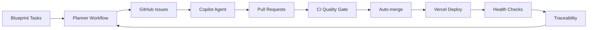

# MaintAInPro CMMS


## 🚀 Enterprise-Grade Computerized Maintenance Management System (CMMS)

MaintAInPro is a next-generation, fully autonomous, multi-tenant CMMS platform
([shared/](shared/))

- **DevOps**: Vercel, Docker, CI/CD, edge functions

### Directory Structure

```
MaintAInPro/
├── client/           # Frontend (React, Vite, Tailwind)
├── server/           # Backend (Express, Drizzle, TypeScript)
├── shared/           # Schemas, types, validation
├── scripts/          # Automation, setup, utility scripts
├── Documentation/    # Comprehensive documentation & blueprints
├── tests/            # Unit, integration, E2E tests
├── migrations/       # Database migrations
├── assets/           # Static assets
├── uploads/          # File uploads
├── Wiki/             # User & developer guides
└── ...
```

## 🗂️ Key Directories & Resources

- **Artifacts**: Templates and records for ADRs, gates, postmortems, RFCs,
  rollout plans, runbooks, and threat modeling. See `artifacts/` for details and
  templates.
- **Runbooks**: Operational guides for calibration, compliance, incident
  response, on-call, release, and rollback. See `runbooks/` for best practices
  and emergency procedures.
- **Scripts**: Automation scripts for backup, changelog, database, deployment,
  development, migration, project management, repo, setup, testing, and workflow
  helpers. See `scripts/` for available scripts and usage.
- **API**: Modular endpoints for attachments, equipment, health, notifications,
  parts, profiles, storage, vendors, work orders, and monitoring. See `api/` for
  API modules and responsibilities.
- **Testing**: Comprehensive test suites for accessibility, API, config, e2e,
  helpers, integration, mocks, performance, security, server, unit, and utils.
  See `tests/` for test coverage and organization.
- **Blueprint & Traceability**: Strategic, technical, feature, UX, traceability,
  and operations documentation. See `Documentation/Blueprint/` and
  `Documentation/Blueprint/5-Traceability/` for governance and compliance.
- **Wiki**: User, developer, and administrator guides, plus reference
  documentation. See `Wiki/` for navigation and guides.

---

## 🧠 Autonomous Development Loop

MaintAInPro features a fully autonomous engineering loop:



- **Planner**: Scans Blueprint docs, creates issues
- **Copilot Agent**: Implements features from `agent-ok` issues
- **CI/CD**: Lint, format, type-check, test, security scan
- **Deployment**: Vercel edge, auto-rollback, health checks
- **Traceability**: Audit logs, changelog, deployment history

---

## 🔒 Security & Compliance

- **Zero-Trust Model**: SOC 2, RBAC, JWT, audit trails
- **Input Validation**: Zod schemas, SQL injection prevention
- **Rate Limiting**: Endpoint-specific controls
- **Secrets Management**: GitHub Actions, Vercel secrets
- **Incident Response**: Automated rollback, emergency issue creation

---

## ⚡ Performance & Scalability

- **Multi-Tier Caching**: Memory, DB, CDN
- **Strategic Indexing**: Optimized queries, connection pooling
- **Edge Functions**: Global performance via Vercel
- **Bundle Optimization**: Code splitting, tree shaking, minification
- **SLA Targets**: <200ms P95 latency, 99.99% uptime

---

## 🏢 Enterprise Features

- **Work Orders**: Full lifecycle, escalation, audit
- **Equipment Management**: QR codes, performance analytics
- **Preventive Maintenance**: Automated scheduling, background jobs
- **Parts Inventory**: Consumption tracking, reorder alerts
- **Vendor/Contractor**: Performance analytics, compliance
- **Real-Time Collaboration**: WebSocket updates, notifications
- **Mobile Support**: Responsive UI, offline-first architecture
- **RBAC**: Role-based access, multi-tenant isolation

---

## 📚 Documentation & Blueprint

- **Blueprint Framework**: Strategic, technical, feature, UX, traceability,
  operations ([Documentation/Blueprint/](Documentation/Blueprint/))
- **Traceability Framework**: Complete audit trails, ADRs, gates, and process
  governance
  ([Documentation/Blueprint/5-Traceability/traceability.md](Documentation/Blueprint/5-Traceability/traceability.md))
- **API Reference**: [Documentation/API/](Documentation/API/)
- **DevOps Guides**: Vercel, Docker, CI/CD
  ([Documentation/Development/](Documentation/Development/))
- **Security & Compliance**:
  [Documentation/Blueprint/3-Architecture/SecurityArchitecture.md](Documentation/Blueprint/3-Architecture/SecurityArchitecture.md)
- **Architecture Decision Records**: [artifacts/adr/](artifacts/adr/)
- **Database Optimization Strategy**:
  [artifacts/adr/adr-database-optimization.md](artifacts/adr/adr-database-optimization.md)
- **Changelog**:
  [Documentation/Development/CHANGELOG.md](Documentation/Development/CHANGELOG.md)

---

## 🧪 Testing & Quality Gates

## 🛠️ Development Workflow

# Build for production

```bash
npm run build
npm run seed         # Seed dev data

vercel --prod       # Deploy to production
```

## ⚙️ Script Usage & Automation

Scripts for automation, setup, and utility tasks are in `scripts/`.

- **Make scripts executable**: `chmod +x script-name.sh`
- **Run from project root**: Most scripts expect to be run from
  `/workspaces/MaintAInPro/`
- **Check dependencies**: Ensure required tools and packages are installed
- **Review configurations**: Check build configs before running deployment
  scripts

Script categories:

- **Shell Scripts (`.sh`)**: System operations, deployment, setup
- **JavaScript/TypeScript**: Node.js utilities, testing, validation
- **Configuration Files**: Build tools, linting, testing setup

### 🪄 Development Phases & Methodology

MaintAInPro uses an iterative, evidence-driven development approach:

**Phase 1: Foundation**

- Project setup, configuration, database, authentication, basic UI

**Phase 2: Core Modules**

- Equipment, Work Orders, User/Roles, Reporting, Mobile

**Phase 3: Advanced Features**

- Preventive Maintenance, Inventory, Vendor, Notifications, Offline sync

**Phase 4: Enhancement & Optimization**

- Performance, security, advanced testing, documentation, deployment

See
[ImplementationMethodology](attached_assets/ImplementationMethodology_1752515902053.md)
and [DevelopmentWorkflow](attached_assets/DevelopmentWorkflow_1752515902051.md)
for details.

**Process Graph & Gates**

- Workflow phases and gates are defined in `.process/graph.yaml` and
  `.process/policies/`.
- CI scripts validate process graph and gate evidence.

**Rollout & Release Process**

- See [artifacts/rollout/PLAN-0001.md](artifacts/rollout/PLAN-0001.md) and
  [Wiki/Changelog.md](Wiki/Changelog.md) for release schedule and procedures.

**Health Snapshot**

| Gate       | Status | Notes                 |
| ---------- | ------ | --------------------- |
| Build      | 🟡     | Needs validation      |
| Lint       | 🟡     | Needs validation      |
| Typecheck  | 🟡     | Needs validation      |
| Unit Tests | 🟡     | Needs validation      |
| E2E Tests  | ⚪     | Not run yet           |
| Coverage   | 🟡     | Needs validation      |
| Deploy     | 🟡     | Vercel config present |

## 🌐 Deployment & Operations

- **GitHub Actions**: Planner, CI/CD, deploy, traceability
- **Monitoring**: Health endpoints, audit logs, performance metrics

- **AI Automation**: Autonomous planner, Copilot agent, predictive maintenance
- **User Experience**: Modern UI, accessibility, real-time collaboration

  [Documentation/CONTRIBUTING.md](Documentation/CONTRIBUTING.md)

- **Issues**: [issues/](issues/)
- **Security**: Report vulnerabilities privately

---

## 📄 License

MaintAInPro is MIT licensed. See [LICENSE](LICENSE) for details.

---

## 🛡️ Troubleshooting & FAQ

### Common Issues

- **Permission errors:** Use `sudo` for global npm installs
- **Snyk vulnerabilities:** See [Snyk documentation](https://security.snyk.io/)
- **CI/CD failures:** Check gate scripts in [ci/](ci/)
- **Test Failures:**
  - **Security Middleware:**
    - Ensure `server/middleware/security.middleware.ts` blocks malicious input
      and returns correct status codes (400/403).
    - See
      [docs/security/enhanced-security-implementation.md](docs/security/enhanced-security-implementation.md)
      for expected behaviors and troubleshooting.
    - Run security tests: `npm run test:unit -- tests/security/`
  - **Backup Service:**
    - Confirm backup service is properly initialized and error handling is
      robust.
    - See `tests/api/backup.test.ts` for integration scenarios.
  - **PM Engine:**
    - Validate compliance calculations, work order generation, and error
      handling in `server/services/pm-engine.ts`.
    - See `tests/unit/services/pm-engine.comprehensive.test.ts` and related
      files for coverage.
  - **Formatters:**
    - Check locale/timezone settings and format strings in utility functions.
    - See `tests/unit/utils/formatters.test.ts` for expected output.
- **Lint Warnings:**
  - Address all `any` type usages and forbidden non-null assertions flagged by
    ESLint.
- **Formatting Issues:**
  - Run `npm run format:check` and fix code style issues with Prettier.

### Support & Documentation

- See [runbooks/](runbooks/) for operational guides
- For technical questions, open an issue or see
  [Documentation/Blueprint/](Documentation/Blueprint/)

### Security & Compliance

- Security middleware implementation and compliance:
  [docs/security/enhanced-security-implementation.md](docs/security/enhanced-security-implementation.md)
- Backup and recovery: [runbooks/backup.md](runbooks/backup.md) if present
- PM scheduling and compliance: [docs/ops/README.md](docs/ops/README.md)

### Test Coverage & CI/CD

- All test types and coverage thresholds: [tests/README.md](tests/README.md)
- CI/CD pipeline and gate requirements: [ci/check_gates.py](ci/check_gates.py),
  [ci/validate_graph.py](ci/validate_graph.py),
  [ci/render_diagrams.py](ci/render_diagrams.py)

## 📞 Support & Contact

- **GitHub Issues**: For bugs, features, and support
- **Discussions**: Community Q&A in [Wiki/](Wiki/)

## 🗂️ Quick Links

## 🗂️ Quick Links

- [Blueprint Framework](Documentation/Blueprint/)
- [Traceability Framework](Documentation/Blueprint/5-Traceability/traceability.md)
- [API Reference](Documentation/API/)
- [DevOps Guides](Documentation/Development/)
- [User Guides](Wiki/)
- [Changelog](Documentation/Development/CHANGELOG.md)
- [Contributing](Documentation/CONTRIBUTING.md)

### Wiki Main Pages

- [Home](Wiki/Home.md)
- [Getting Started](Wiki/Getting-Started.md)
- [User Guide](Wiki/User-Guide.md)
- [Developer Guide](Wiki/Developer-Guide.md)
- [API Reference](Wiki/API-Reference.md)
- [Architecture](Wiki/Architecture.md)
- [Deployment Guide](Wiki/Deployment-Guide.md)
- [Troubleshooting](Wiki/Troubleshooting.md)
- [Changelog](Wiki/Changelog.md)

### Wiki Main Pages (Full Coverage)

- [Home](Wiki/Home.md)
- [Getting Started](Wiki/Getting-Started.md)
- [User Guide](Wiki/User-Guide.md)
- [Developer Guide](Wiki/Developer-Guide.md)
- [API Reference](Wiki/API-Reference.md)
- [Architecture](Wiki/Architecture.md)
- [Deployment Guide](Wiki/Deployment-Guide.md)
- [Troubleshooting](Wiki/Troubleshooting.md)
- [Changelog](Wiki/Changelog.md)
- [Roadmap](Wiki/Roadmap.md)
- [Performance Guide](Wiki/Performance-Guide.md)
- [Operations Guide](Wiki/Operations-Guide.md)
- [Security Guide](Wiki/Security-Guide.md)
- [Testing Guide](Wiki/Testing-Guide.md)
- [Equipment Management](Wiki/Equipment-Management.md)
- [Parts Inventory](Wiki/Parts-Inventory.md)
- [Work Orders](Wiki/Work-Orders.md)

## 📝 Documentation & Contribution Maintenance

- Log all edits in `Documentation/Edits/` (create a new Markdown file per
  feature/fix, or append if contextually related)
- Update `Documentation/Blueprint/` only for long-term vision or traceability
  changes
- Always update `ROADMAP.md` and `README.md` for milestone completion, version
  updates, configuration changes, and known issues/resolutions
- For behavioral/architectural changes, update
  `Documentation/Blueprint/5-Traceability/TraceabilityMatrix.md`
- See [Documentation/CONTRIBUTING.md](Documentation/CONTRIBUTING.md) for
  contribution guidelines

---

> _MaintAInPro: Autonomous, secure, and scalable CMMS for the modern
> enterprise._
