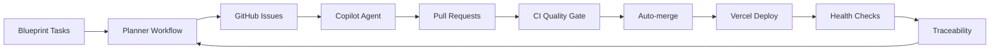

# MaintAInPro CMMS


---

## 🚀 Enterprise-Grade Computerized Maintenance Management System (CMMS)

MaintAInPro is a next-generation, fully autonomous, multi-tenant CMMS platform
engineered for operational excellence, security, and scalability. It leverages
AI automation, real-time collaboration, and advanced analytics to deliver
best-in-class maintenance management for enterprises.

---

## 🏗️ Architecture Overview

- **Frontend**: React 18, TypeScript, Vite, TailwindCSS ([client/](client/))
- **Backend**: Express.js, TypeScript, Drizzle ORM ([server/](server/))
- **Database**: PostgreSQL, strategic indexing, multi-tenant
  ([shared/](shared/))
- **Shared**: Common schemas, types, validation ([shared/](shared/))
- **DevOps**: Vercel, Docker, CI/CD, edge functions

### Directory Structure

```
MaintAInPro/
├── client/           # Frontend (React, Vite, Tailwind)
├── server/           # Backend (Express, Drizzle, TypeScript)
├── shared/           # Schemas, types, validation
├── scripts/          # Automation, setup, utility scripts
├── Documentation/    # Comprehensive documentation & blueprints
├── tests/            # Unit, integration, E2E tests
├── migrations/       # Database migrations
├── assets/           # Static assets
├── uploads/          # File uploads
├── Wiki/             # User & developer guides
└── ...
```

---

## 🧠 Autonomous Development Loop

MaintAInPro features a fully autonomous engineering loop:



- **Planner**: Scans Blueprint docs, creates issues
- **Copilot Agent**: Implements features from `agent-ok` issues
- **CI/CD**: Lint, format, type-check, test, security scan
- **Deployment**: Vercel edge, auto-rollback, health checks
- **Traceability**: Audit logs, changelog, deployment history

---

## 🔒 Security & Compliance

- **Zero-Trust Model**: SOC 2, RBAC, JWT, audit trails
- **Input Validation**: Zod schemas, SQL injection prevention
- **Rate Limiting**: Endpoint-specific controls
- **Secrets Management**: GitHub Actions, Vercel secrets
- **Incident Response**: Automated rollback, emergency issue creation

---

## ⚡ Performance & Scalability

- **Multi-Tier Caching**: Memory, DB, CDN
- **Strategic Indexing**: Optimized queries, connection pooling
- **Edge Functions**: Global performance via Vercel
- **Bundle Optimization**: Code splitting, tree shaking, minification
- **SLA Targets**: <200ms P95 latency, 99.99% uptime

---

## 🏢 Enterprise Features

- **Work Orders**: Full lifecycle, escalation, audit
- **Equipment Management**: QR codes, performance analytics
- **Preventive Maintenance**: Automated scheduling, background jobs
- **Parts Inventory**: Consumption tracking, reorder alerts
- **Vendor/Contractor**: Performance analytics, compliance
- **Real-Time Collaboration**: WebSocket updates, notifications
- **Mobile Support**: Responsive UI, offline-first architecture
- **RBAC**: Role-based access, multi-tenant isolation

---

## 📚 Documentation & Blueprint

- **Blueprint Framework**: Strategic, technical, feature, UX, traceability,
  operations ([Documentation/Blueprint/](Documentation/Blueprint/))
- **API Reference**: [Documentation/API/](Documentation/API/)
- **DevOps Guides**: Vercel, Docker, CI/CD
  ([Documentation/Development/](Documentation/Development/))
- **Security & Compliance**:
  [Documentation/Blueprint/3-Architecture/SecurityArchitecture.md](Documentation/Blueprint/3-Architecture/SecurityArchitecture.md)
- **User Guides**: [Wiki/](Wiki/)
- **Changelog**:
  [Documentation/Development/CHANGELOG.md](Documentation/Development/CHANGELOG.md)

---

## 🧪 Testing & Quality Gates

- **Unit Tests**: Vitest ([tests/](tests/))
- **Integration Tests**: API, DB, workflows
- **E2E Tests**: Playwright
- **Coverage**: 95%+ required
- **Quality Checks**: `npm run quality` (lint, format, type-check, test)

---

## 🛠️ Development Workflow

```bash
# Start development server
npm run dev

# Run all tests
npm run test:all

# Build for production
npm run build

# Database operations
npm run db:push      # Push schema changes
npm run db:generate  # Generate migrations
npm run seed         # Seed dev data

# Vercel deployment
vercel              # Deploy to preview
vercel --prod       # Deploy to production
```

---

## 🌐 Deployment & Operations

- **Vercel**: Edge-optimized, preview/production, auto-rollback
- **Docker**: Local development, CI consistency
- **GitHub Actions**: Planner, CI/CD, deploy, traceability
- **Monitoring**: Health endpoints, audit logs, performance metrics

---

## 🏆 Competitive Differentiation

- **AI Automation**: Autonomous planner, Copilot agent, predictive maintenance
- **Enterprise Security**: SOC 2, zero-trust, audit trails
- **Performance**: <200ms latency, global edge
- **Scalability**: Multi-tenant, hierarchical orgs
- **User Experience**: Modern UI, accessibility, real-time collaboration

---

## 🤝 Contributing & Community

- **Contributing Guide**:
  [Documentation/CONTRIBUTING.md](Documentation/CONTRIBUTING.md)
- **Issues**: [issues/](issues/)
- **Discussions**: [Wiki/](Wiki/)
- **Security**: Report vulnerabilities privately

---

## 📄 License

MaintAInPro is MIT licensed. See [LICENSE](LICENSE) for details.

---

## 📞 Support & Contact

- **GitHub Issues**: For bugs, features, and support
- **Discussions**: Community Q&A in [Wiki/](Wiki/)
- **Documentation**: Comprehensive guides in [Documentation/](Documentation/)

---

## 🗂️ Quick Links

- [Blueprint Framework](Documentation/Blueprint/)
- [API Reference](Documentation/API/)
- [DevOps Guides](Documentation/Development/)
- [User Guides](Wiki/)
- [Changelog](Documentation/Development/CHANGELOG.md)
- [Contributing](Documentation/CONTRIBUTING.md)

---

> _MaintAInPro: Autonomous, secure, and scalable CMMS for the modern
> enterprise._
