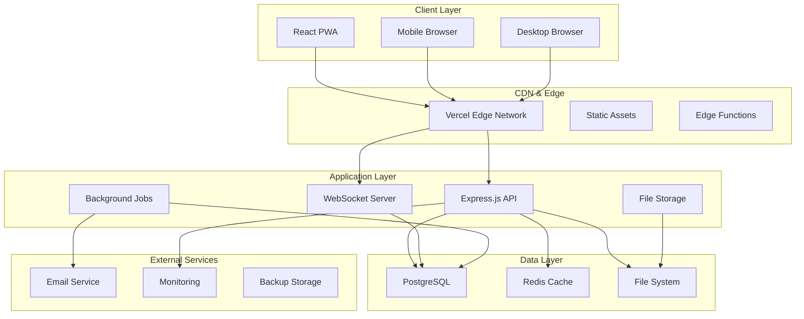
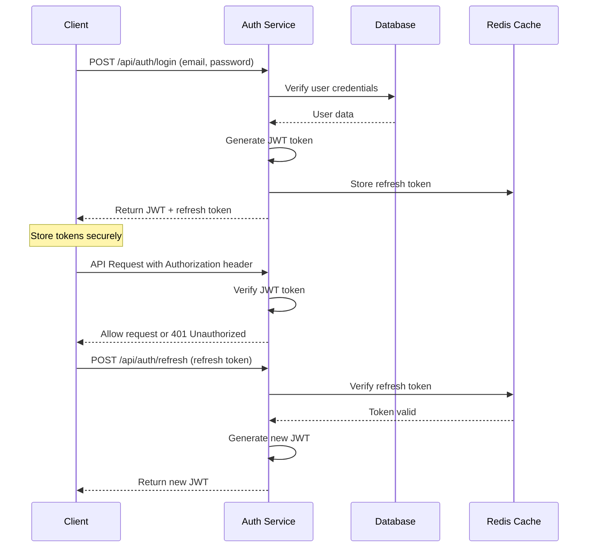
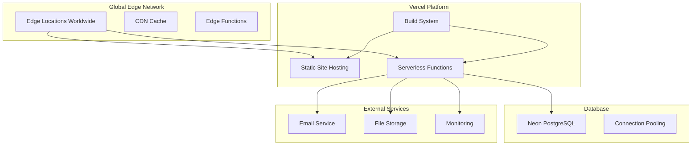
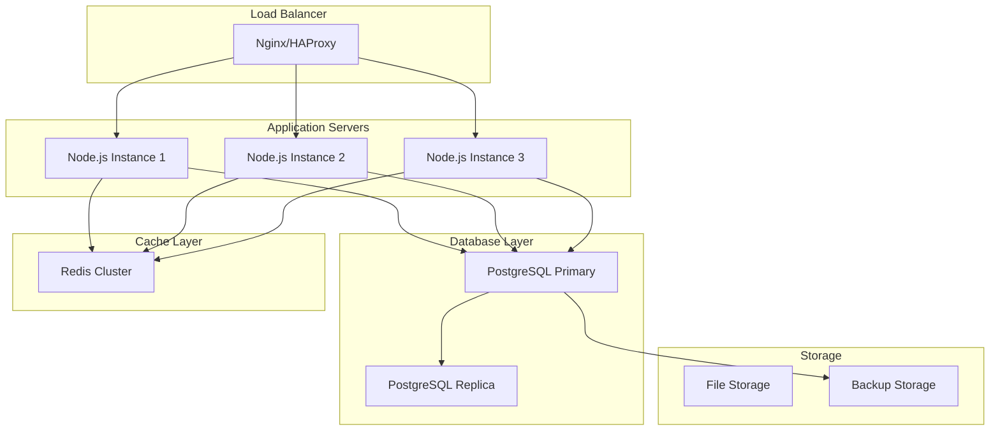

# 🏗️ Architecture

Comprehensive technical architecture documentation for MaintAInPro CMMS,
covering system design, technologies, patterns, and scalability considerations.

## 📋 Table of Contents

- [**System Overview**](#-system-overview)
- [**Technology Stack**](#-technology-stack)
- [**Application Architecture**](#-application-architecture)
- [**Database Design**](#-database-design)
- [**API Design**](#-api-design)
- [**Security Architecture**](#-security-architecture)
- [**Performance & Scalability**](#-performance--scalability)
- [**Deployment Architecture**](#-deployment-architecture)
- [**Design Patterns**](#-design-patterns)
- [**Integration Points**](#-integration-points)

## 🎯 System Overview

MaintAInPro follows a modern, full-stack architecture designed for
enterprise-grade maintenance management with multi-tenant support, real-time
capabilities, and mobile-first design.

### High-Level Architecture



### Core Principles

**1. Multi-Tenant Architecture**

- Organization-level data isolation
- Shared application instance
- Row-level security policies
- Hierarchical data organization

**2. API-First Design**

- RESTful API with OpenAPI specification
- Consistent request/response patterns
- Comprehensive error handling
- Versioning strategy

**3. Real-Time Capabilities**

- WebSocket connections for live updates
- Event-driven architecture
- Push notifications for mobile
- Collaborative features

**4. Mobile-First Approach**

- Progressive Web App (PWA)
- Offline-first design with sync
- Touch-optimized interfaces
- QR code integration

**5. Enterprise Security**

- JWT-based authentication
- Role-based access control (RBAC)
- API rate limiting
- Audit logging

## 🔧 Technology Stack

### Frontend Stack

```typescript
// Core Framework
React 18              // Component framework with Concurrent Features
TypeScript 5.6        // Type safety and developer experience
Vite 5.4              // Build tool with HMR and ESM

// UI Framework
TailwindCSS 3.4       // Utility-first CSS framework
Radix UI              // Accessible component primitives
Lucide React          // Icon library

// State Management
React Query (TanStack) // Server state management
React Hook Form       // Form handling with validation
Zustand              // Client state management (if needed)

// Development Tools
Vitest 1.1           // Unit testing framework
Playwright           // End-to-end testing
ESLint + Prettier    // Code quality and formatting
```

### Backend Stack

```typescript
// Core Framework
Express.js 4.21       // Web application framework
TypeScript 5.6        // Type safety
Node.js 18+           // Runtime environment

// Database & ORM
PostgreSQL 15+        // Primary database
Drizzle ORM 0.39      // Type-safe ORM
Drizzle-Kit 0.30      // Migration tool

// Validation & Security
Zod 3.24              // Schema validation
bcryptjs 3.0          // Password hashing
jsonwebtoken 9.0      // JWT authentication
helmet 8.1            // Security headers

// Utilities
date-fns 3.6          // Date manipulation
uuid 11.1             // UUID generation
multer 2.0            // File upload handling
node-cron 4.2         // Scheduled tasks
```

### Infrastructure Stack

```yaml
# Deployment Platform
Vercel: # Serverless deployment with global CDN
  - Edge Functions # API routes as serverless functions
  - Static Hosting # Frontend assets with CDN
  - Database # Managed PostgreSQL (Neon/Supabase)

# Alternative Platforms
Railway: # Full-stack platform with integrated DB
Docker: # Containerized deployment
On-Premises: # Self-hosted infrastructure

# Monitoring & Observability
Vercel Analytics: # Web vitals and performance
PM2: # Process management (self-hosted)
PostgreSQL Logs: # Database monitoring
```

## 🏢 Application Architecture

### Frontend Architecture

```
client/
├── src/
│   ├── components/          # Reusable UI components
│   │   ├── ui/             # Base UI components (Button, Input, etc.)
│   │   ├── forms/          # Form components
│   │   ├── charts/         # Data visualization
│   │   └── layout/         # Layout components
│   ├── pages/              # Route-level components
│   │   ├── dashboard/      # Dashboard views
│   │   ├── work-orders/    # Work order management
│   │   ├── equipment/      # Equipment management
│   │   └── parts/          # Parts inventory
│   ├── hooks/              # Custom React hooks
│   │   ├── useAuth.ts      # Authentication state
│   │   ├── useWorkOrders.ts # Work order operations
│   │   └── useApi.ts       # API communication
│   ├── services/           # API client functions
│   │   ├── api.ts          # Base API client
│   │   ├── auth.ts         # Authentication service
│   │   └── workOrders.ts   # Work order API calls
│   ├── lib/                # Utilities and configurations
│   │   ├── utils.ts        # Helper functions
│   │   ├── constants.ts    # Application constants
│   │   └── validations.ts  # Form validation schemas
│   └── types/              # TypeScript type definitions
       ├── api.ts           # API response types
       ├── entities.ts      # Domain entity types
       └── forms.ts         # Form data types
```

### Component Architecture

```typescript
// Example: Work Order Component Structure

// 1. Base Hook
const useWorkOrders = (filters?: WorkOrderFilters) => {
  const { data, isLoading, error, mutate } = useSWR(
    ['work-orders', filters],
    () => workOrderService.getWorkOrders(filters)
  );

  return {
    workOrders: data?.data || [],
    isLoading,
    error,
    refetch: mutate,
    createWorkOrder: (data: CreateWorkOrderInput) =>
      workOrderService.create(data).then(() => mutate()),
  };
};

// 2. List Component
const WorkOrderList: React.FC<WorkOrderListProps> = ({ filters }) => {
  const { workOrders, isLoading, createWorkOrder } = useWorkOrders(filters);

  if (isLoading) return <WorkOrderSkeleton />;

  return (
    <div className="space-y-4">
      {workOrders.map(workOrder => (
        <WorkOrderCard
          key={workOrder.id}
          workOrder={workOrder}
        />
      ))}
    </div>
  );
};

// 3. Card Component
const WorkOrderCard: React.FC<{ workOrder: WorkOrder }> = ({ workOrder }) => {
  return (
    <Card className="p-4">
      <CardHeader>
        <h3 className="font-medium">{workOrder.title}</h3>
        <StatusBadge status={workOrder.status} />
      </CardHeader>
      <CardContent>
        <p className="text-gray-600">{workOrder.description}</p>
        <WorkOrderMetadata workOrder={workOrder} />
      </CardContent>
      <CardActions>
        <WorkOrderActions workOrder={workOrder} />
      </CardActions>
    </Card>
  );
};
```

### Backend Architecture

```
server/
├── index.ts                # Application entry point
├── routes/                 # API route handlers
│   ├── auth.ts            # Authentication routes
│   ├── workOrders.ts      # Work order CRUD operations
│   ├── equipment.ts       # Equipment management
│   └── api-v2.ts          # Versioned API routes
├── services/              # Business logic layer
│   ├── auth.service.ts    # Authentication logic
│   ├── workOrder.service.ts # Work order business logic
│   ├── equipment.service.ts # Equipment operations
│   ├── notification.service.ts # Notification handling
│   └── background-jobs.ts # Scheduled tasks
├── middleware/            # Express middleware
│   ├── auth.middleware.ts # Authentication middleware
│   ├── validation.middleware.ts # Input validation
│   ├── error.middleware.ts # Error handling
│   └── audit.middleware.ts # Audit logging
└── utils/                 # Utility functions
    ├── database.ts        # Database utilities
    ├── email.ts           # Email utilities
    └── file.ts            # File handling utilities
```

### Service Layer Pattern

```typescript
// Example: Work Order Service

export class WorkOrderService {
  // Create work order with validation and audit trail
  async create(data: CreateWorkOrderInput, userId: string): Promise<WorkOrder> {
    // 1. Validate input
    const validatedData = createWorkOrderSchema.parse(data);

    // 2. Check permissions
    await this.checkCreatePermissions(userId, validatedData.organizationId);

    // 3. Generate work order number
    const foNumber = await this.generateWorkOrderNumber(
      validatedData.organizationId
    );

    // 4. Create work order
    const workOrder = await db
      .insert(workOrders)
      .values({
        ...validatedData,
        foNumber,
        createdBy: userId,
        status: 'open',
      })
      .returning();

    // 5. Create audit log
    await this.createAuditLog('create', workOrder[0], userId);

    // 6. Send notifications
    await this.sendAssignmentNotifications(workOrder[0]);

    return workOrder[0];
  }

  // Update work order with status transitions
  async update(
    id: string,
    updates: UpdateWorkOrderInput,
    userId: string
  ): Promise<WorkOrder> {
    // 1. Get current work order
    const current = await this.getById(id, userId);

    // 2. Validate status transition
    if (updates.status) {
      await this.validateStatusTransition(current.status, updates.status);
    }

    // 3. Apply updates
    const updated = await db
      .update(workOrders)
      .set({
        ...updates,
        updatedAt: new Date(),
        lastUpdatedBy: userId,
      })
      .where(eq(workOrders.id, id))
      .returning();

    // 4. Create audit log
    await this.createAuditLog('update', updated[0], userId, current);

    // 5. Handle status-specific logic
    if (updates.status === 'completed') {
      await this.handleCompletion(updated[0]);
    }

    return updated[0];
  }

  // Get work orders with filtering and pagination
  async getWorkOrders(
    filters: WorkOrderFilters,
    organizationId: string
  ): Promise<PaginatedResponse<WorkOrder>> {
    const query = db
      .select({
        workOrder: workOrders,
        equipment: equipment,
        assignee: users,
      })
      .from(workOrders)
      .leftJoin(equipment, eq(workOrders.equipmentId, equipment.id))
      .leftJoin(users, eq(workOrders.assignedTo, users.id))
      .where(eq(workOrders.organizationId, organizationId));

    // Apply filters
    if (filters.status) {
      query.where(eq(workOrders.status, filters.status));
    }

    if (filters.priority) {
      query.where(eq(workOrders.priority, filters.priority));
    }

    if (filters.search) {
      query.where(
        or(
          ilike(workOrders.title, `%${filters.search}%`),
          ilike(workOrders.description, `%${filters.search}%`)
        )
      );
    }

    // Apply pagination
    const total = await db
      .select({ count: count() })
      .from(workOrders)
      .where(eq(workOrders.organizationId, organizationId));

    const results = await query
      .limit(filters.limit || 50)
      .offset(filters.offset || 0)
      .orderBy(desc(workOrders.createdAt));

    return {
      data: results.map(r => ({
        ...r.workOrder,
        equipment: r.equipment,
        assignee: r.assignee,
      })),
      meta: {
        total: total[0].count,
        limit: filters.limit || 50,
        offset: filters.offset || 0,
      },
    };
  }
}
```

## 🗄️ Database Design

### Schema Architecture

MaintAInPro uses PostgreSQL with a carefully designed schema supporting
multi-tenancy, audit trails, and hierarchical data structures.

### Core Entities

```sql
-- Organizations (Multi-tenant root)
CREATE TABLE organizations (
    id UUID PRIMARY KEY DEFAULT gen_random_uuid(),
    name VARCHAR(255) NOT NULL,
    settings JSONB DEFAULT '{}',
    created_at TIMESTAMP DEFAULT CURRENT_TIMESTAMP,
    updated_at TIMESTAMP DEFAULT CURRENT_TIMESTAMP
);

-- Users with RBAC
CREATE TABLE users (
    id UUID PRIMARY KEY DEFAULT gen_random_uuid(),
    organization_id UUID NOT NULL REFERENCES organizations(id),
    email VARCHAR(255) UNIQUE NOT NULL,
    password_hash VARCHAR(255) NOT NULL,
    first_name VARCHAR(100),
    last_name VARCHAR(100),
    role user_role_enum NOT NULL DEFAULT 'technician',
    phone VARCHAR(20),
    active BOOLEAN DEFAULT true,
    last_login TIMESTAMP,
    created_at TIMESTAMP DEFAULT CURRENT_TIMESTAMP,
    updated_at TIMESTAMP DEFAULT CURRENT_TIMESTAMP
);

-- Equipment with hierarchy support
CREATE TABLE equipment (
    id UUID PRIMARY KEY DEFAULT gen_random_uuid(),
    organization_id UUID NOT NULL REFERENCES organizations(id),
    asset_tag VARCHAR(50) UNIQUE NOT NULL,
    fo_number VARCHAR(50),
    model VARCHAR(100),
    manufacturer VARCHAR(100),
    serial_number VARCHAR(100),
    description TEXT,
    area VARCHAR(100),
    status equipment_status_enum DEFAULT 'active',
    criticality criticality_enum DEFAULT 'medium',
    installation_date DATE,
    warranty_expiry DATE,
    parent_equipment_id UUID REFERENCES equipment(id),
    hierarchy_level INTEGER DEFAULT 0,
    qr_code_url TEXT,
    created_at TIMESTAMP DEFAULT CURRENT_TIMESTAMP,
    updated_at TIMESTAMP DEFAULT CURRENT_TIMESTAMP
);

-- Work Orders
CREATE TABLE work_orders (
    id UUID PRIMARY KEY DEFAULT gen_random_uuid(),
    organization_id UUID NOT NULL REFERENCES organizations(id),
    fo_number VARCHAR(50) UNIQUE NOT NULL,
    title VARCHAR(255) NOT NULL,
    description TEXT,
    type wo_type_enum NOT NULL DEFAULT 'corrective',
    status wo_status_enum NOT NULL DEFAULT 'open',
    priority priority_enum NOT NULL DEFAULT 'medium',
    equipment_id UUID REFERENCES equipment(id),
    assigned_to UUID[] DEFAULT '{}',
    requested_by UUID NOT NULL REFERENCES users(id),
    created_by UUID NOT NULL REFERENCES users(id),
    due_date TIMESTAMP,
    completed_at TIMESTAMP,
    verified_by UUID REFERENCES users(id),
    escalated BOOLEAN DEFAULT false,
    escalation_level INTEGER DEFAULT 0,
    created_at TIMESTAMP DEFAULT CURRENT_TIMESTAMP,
    updated_at TIMESTAMP DEFAULT CURRENT_TIMESTAMP
);

-- Parts Inventory
CREATE TABLE parts (
    id UUID PRIMARY KEY DEFAULT gen_random_uuid(),
    organization_id UUID NOT NULL REFERENCES organizations(id),
    part_number VARCHAR(100) UNIQUE NOT NULL,
    description TEXT NOT NULL,
    category VARCHAR(100),
    supplier VARCHAR(100),
    unit_price DECIMAL(10,2),
    currency VARCHAR(3) DEFAULT 'USD',
    stock_quantity INTEGER DEFAULT 0,
    min_stock_level INTEGER DEFAULT 0,
    max_stock_level INTEGER DEFAULT 0,
    reorder_point INTEGER DEFAULT 0,
    location VARCHAR(100),
    created_at TIMESTAMP DEFAULT CURRENT_TIMESTAMP,
    updated_at TIMESTAMP DEFAULT CURRENT_TIMESTAMP
);
```

### Enums and Types

```sql
-- User roles
CREATE TYPE user_role_enum AS ENUM (
    'admin', 'manager', 'technician', 'requester'
);

-- Work order types
CREATE TYPE wo_type_enum AS ENUM (
    'corrective', 'preventive', 'inspection', 'emergency'
);

-- Work order status
CREATE TYPE wo_status_enum AS ENUM (
    'open', 'in_progress', 'on_hold', 'completed', 'verified', 'cancelled'
);

-- Priority levels
CREATE TYPE priority_enum AS ENUM (
    'low', 'medium', 'high', 'critical'
);

-- Equipment status
CREATE TYPE equipment_status_enum AS ENUM (
    'active', 'maintenance', 'decommissioned', 'retired'
);

-- Criticality levels
CREATE TYPE criticality_enum AS ENUM (
    'low', 'medium', 'high', 'critical'
);
```

### Indexes for Performance

```sql
-- Organization-based indexes (multi-tenant)
CREATE INDEX idx_users_organization ON users(organization_id);
CREATE INDEX idx_equipment_organization ON equipment(organization_id);
CREATE INDEX idx_work_orders_organization ON work_orders(organization_id);
CREATE INDEX idx_parts_organization ON parts(organization_id);

-- Work order performance indexes
CREATE INDEX idx_work_orders_status ON work_orders(status);
CREATE INDEX idx_work_orders_assigned ON work_orders USING GIN(assigned_to);
CREATE INDEX idx_work_orders_due_date ON work_orders(due_date) WHERE status IN ('open', 'in_progress');
CREATE INDEX idx_work_orders_equipment ON work_orders(equipment_id);

-- Equipment hierarchy index
CREATE INDEX idx_equipment_parent ON equipment(parent_equipment_id);
CREATE INDEX idx_equipment_hierarchy ON equipment(organization_id, hierarchy_level);

-- Search indexes
CREATE INDEX idx_work_orders_search ON work_orders USING GIN(to_tsvector('english', title || ' ' || description));
CREATE INDEX idx_equipment_search ON equipment USING GIN(to_tsvector('english', asset_tag || ' ' || description));

-- Audit and performance indexes
CREATE INDEX idx_work_orders_created_at ON work_orders(created_at);
CREATE INDEX idx_users_last_login ON users(last_login);
```

### Row Level Security (RLS)

```sql
-- Enable RLS on all tenant tables
ALTER TABLE users ENABLE ROW LEVEL SECURITY;
ALTER TABLE equipment ENABLE ROW LEVEL SECURITY;
ALTER TABLE work_orders ENABLE ROW LEVEL SECURITY;
ALTER TABLE parts ENABLE ROW LEVEL SECURITY;

-- Users can only access their organization's data
CREATE POLICY users_org_policy ON users
    FOR ALL
    USING (organization_id = current_setting('app.current_organization_id')::UUID);

CREATE POLICY equipment_org_policy ON equipment
    FOR ALL
    USING (organization_id = current_setting('app.current_organization_id')::UUID);

CREATE POLICY work_orders_org_policy ON work_orders
    FOR ALL
    USING (organization_id = current_setting('app.current_organization_id')::UUID);

CREATE POLICY parts_org_policy ON parts
    FOR ALL
    USING (organization_id = current_setting('app.current_organization_id')::UUID);
```

## 🔗 API Design

### RESTful API Principles

MaintAInPro follows REST conventions with consistent patterns:

```typescript
// Resource naming conventions
GET    /api/work-orders              // List resources
POST   /api/work-orders              // Create resource
GET    /api/work-orders/:id          // Get specific resource
PUT    /api/work-orders/:id          // Update resource (full)
PATCH  /api/work-orders/:id          // Update resource (partial)
DELETE /api/work-orders/:id          // Delete resource

// Nested resources
GET    /api/equipment/:id/work-orders    // Get work orders for equipment
POST   /api/work-orders/:id/time-logs    // Add time log to work order
GET    /api/work-orders/:id/attachments  // Get work order attachments
```

### Response Format Standards

```typescript
// Success response format
interface ApiResponse<T> {
  success: true;
  data: T;
  meta?: {
    total?: number;
    page?: number;
    limit?: number;
    cursor?: string;
  };
}

// Error response format
interface ApiError {
  success: false;
  error: {
    code: string;
    message: string;
    details?: Record<string, any>;
    timestamp: string;
    requestId: string;
  };
}
```

### Input Validation

```typescript
// Zod schemas for validation
export const createWorkOrderSchema = z.object({
  title: z.string().min(1, 'Title is required').max(255),
  description: z.string().max(2000).optional(),
  type: z.enum(['corrective', 'preventive', 'inspection', 'emergency']),
  priority: z.enum(['low', 'medium', 'high', 'critical']),
  equipmentId: z.string().uuid().optional(),
  assignedTo: z.array(z.string().uuid()).optional(),
  dueDate: z.string().datetime().optional(),
});

// Validation middleware
export const validateSchema = (schema: z.ZodSchema) => {
  return (req: Request, res: Response, next: NextFunction) => {
    try {
      const validated = schema.parse(req.body);
      req.body = validated;
      next();
    } catch (error) {
      if (error instanceof z.ZodError) {
        return res.status(400).json({
          success: false,
          error: {
            code: 'VALIDATION_ERROR',
            message: 'Invalid input data',
            details: error.errors,
            timestamp: new Date().toISOString(),
            requestId: req.id,
          },
        });
      }
      next(error);
    }
  };
};
```

## 🔐 Security Architecture

### Authentication Flow



### JWT Token Structure

```typescript
interface JWTPayload {
  userId: string;
  organizationId: string;
  role: UserRole;
  permissions: string[];
  iat: number; // Issued at
  exp: number; // Expires at
  iss: string; // Issuer
  aud: string; // Audience
}

// Token generation
const generateToken = (user: User): string => {
  const payload: JWTPayload = {
    userId: user.id,
    organizationId: user.organizationId,
    role: user.role,
    permissions: getRolePermissions(user.role),
    iat: Math.floor(Date.now() / 1000),
    exp: Math.floor(Date.now() / 1000) + 24 * 60 * 60, // 24 hours
    iss: 'maintainpro',
    aud: 'maintainpro-api',
  };

  return jwt.sign(payload, process.env.JWT_SECRET!);
};
```

### Role-Based Access Control (RBAC)

```typescript
// Permission definitions
export const PERMISSIONS = {
  WORK_ORDERS: {
    VIEW: 'work_orders:view',
    CREATE: 'work_orders:create',
    UPDATE: 'work_orders:update',
    DELETE: 'work_orders:delete',
    ASSIGN: 'work_orders:assign',
  },
  EQUIPMENT: {
    VIEW: 'equipment:view',
    CREATE: 'equipment:create',
    UPDATE: 'equipment:update',
    DELETE: 'equipment:delete',
  },
  USERS: {
    VIEW: 'users:view',
    CREATE: 'users:create',
    UPDATE: 'users:update',
    DELETE: 'users:delete',
  },
} as const;

// Role permissions
export const ROLE_PERMISSIONS = {
  admin: Object.values(PERMISSIONS).flatMap(p => Object.values(p)),
  manager: [
    PERMISSIONS.WORK_ORDERS.VIEW,
    PERMISSIONS.WORK_ORDERS.CREATE,
    PERMISSIONS.WORK_ORDERS.UPDATE,
    PERMISSIONS.WORK_ORDERS.ASSIGN,
    PERMISSIONS.EQUIPMENT.VIEW,
    PERMISSIONS.EQUIPMENT.UPDATE,
    PERMISSIONS.USERS.VIEW,
  ],
  technician: [
    PERMISSIONS.WORK_ORDERS.VIEW,
    PERMISSIONS.WORK_ORDERS.UPDATE,
    PERMISSIONS.EQUIPMENT.VIEW,
  ],
  requester: [
    PERMISSIONS.WORK_ORDERS.VIEW,
    PERMISSIONS.WORK_ORDERS.CREATE,
    PERMISSIONS.EQUIPMENT.VIEW,
  ],
};

// Authorization middleware
export const requirePermission = (permission: string) => {
  return (req: Request, res: Response, next: NextFunction) => {
    const user = req.user;

    if (!user) {
      return res.status(401).json({
        success: false,
        error: {
          code: 'UNAUTHORIZED',
          message: 'Authentication required',
        },
      });
    }

    if (!user.permissions.includes(permission)) {
      return res.status(403).json({
        success: false,
        error: {
          code: 'FORBIDDEN',
          message: 'Insufficient permissions',
        },
      });
    }

    next();
  };
};
```

## ⚡ Performance & Scalability

### Frontend Performance

**Code Splitting:**

```typescript
// Route-based code splitting
const WorkOrdersPage = lazy(() => import('./pages/WorkOrdersPage'));
const EquipmentPage = lazy(() => import('./pages/EquipmentPage'));
const PartsPage = lazy(() => import('./pages/PartsPage'));

// Component-based splitting
const WorkOrderDetails = lazy(() => import('./components/WorkOrderDetails'));
```

**Caching Strategies:**

```typescript
// React Query caching
const useWorkOrders = (filters: WorkOrderFilters) => {
  return useQuery({
    queryKey: ['work-orders', filters],
    queryFn: () => api.workOrders.list(filters),
    staleTime: 5 * 60 * 1000, // 5 minutes
    gcTime: 10 * 60 * 1000, // 10 minutes
    refetchOnWindowFocus: false,
  });
};

// Service Worker caching
self.addEventListener('fetch', event => {
  if (event.request.url.includes('/api/')) {
    // Network first for API requests
    event.respondWith(networkFirst(event.request));
  } else {
    // Cache first for static assets
    event.respondWith(cacheFirst(event.request));
  }
});
```

### Backend Performance

**Database Query Optimization:**

```typescript
// Efficient joins with selected fields
const getWorkOrdersWithDetails = async (organizationId: string) => {
  return db
    .select({
      id: workOrders.id,
      title: workOrders.title,
      status: workOrders.status,
      priority: workOrders.priority,
      equipmentTag: equipment.assetTag,
      assigneeName: sql<string>`${users.firstName} || ' ' || ${users.lastName}`,
    })
    .from(workOrders)
    .leftJoin(equipment, eq(workOrders.equipmentId, equipment.id))
    .leftJoin(users, sql`${users.id} = ANY(${workOrders.assignedTo})`)
    .where(eq(workOrders.organizationId, organizationId))
    .limit(50);
};

// Pagination with cursor-based approach
const getPaginatedWorkOrders = async (
  organizationId: string,
  cursor?: string,
  limit = 50
) => {
  const query = db
    .select()
    .from(workOrders)
    .where(eq(workOrders.organizationId, organizationId))
    .orderBy(desc(workOrders.createdAt))
    .limit(limit + 1);

  if (cursor) {
    query.where(lt(workOrders.createdAt, new Date(cursor)));
  }

  const results = await query;
  const hasMore = results.length > limit;
  const items = hasMore ? results.slice(0, -1) : results;

  return {
    items,
    hasMore,
    nextCursor: hasMore
      ? items[items.length - 1].createdAt.toISOString()
      : null,
  };
};
```

**Caching Layer:**

```typescript
// Redis caching service
export class CacheService {
  private redis = new Redis(process.env.REDIS_URL);

  async get<T>(key: string): Promise<T | null> {
    const value = await this.redis.get(key);
    return value ? JSON.parse(value) : null;
  }

  async set(key: string, value: any, ttl = 3600): Promise<void> {
    await this.redis.setex(key, ttl, JSON.stringify(value));
  }

  async del(key: string): Promise<void> {
    await this.redis.del(key);
  }

  // Cache work orders with automatic invalidation
  async cacheWorkOrders(organizationId: string, filters: any, data: any) {
    const key = `work-orders:${organizationId}:${JSON.stringify(filters)}`;
    await this.set(key, data, 300); // 5 minutes
  }

  async invalidateWorkOrdersCache(organizationId: string) {
    const pattern = `work-orders:${organizationId}:*`;
    const keys = await this.redis.keys(pattern);
    if (keys.length > 0) {
      await this.redis.del(...keys);
    }
  }
}
```

### Scalability Considerations

**Horizontal Scaling:**

- Stateless application design
- Database connection pooling
- Load balancer compatibility
- Session storage in Redis

**Database Scaling:**

- Read replicas for reporting
- Partitioning by organization
- Connection pooling
- Query optimization

**File Storage Scaling:**

- CDN integration
- Multiple storage backends
- Compression and optimization
- Cleanup jobs for unused files

## 🚀 Deployment Architecture

### Vercel Deployment



**Benefits:**

- Global CDN with 100+ edge locations
- Automatic scaling and zero configuration
- Built-in monitoring and analytics
- Instant deployments and rollbacks

### On-Premises Architecture



## 🎨 Design Patterns

### Repository Pattern

```typescript
// Abstract repository interface
interface Repository<T, ID> {
  findById(id: ID): Promise<T | null>;
  findAll(filters?: any): Promise<T[]>;
  create(data: Partial<T>): Promise<T>;
  update(id: ID, data: Partial<T>): Promise<T>;
  delete(id: ID): Promise<void>;
}

// Work Order Repository implementation
export class WorkOrderRepository implements Repository<WorkOrder, string> {
  async findById(id: string): Promise<WorkOrder | null> {
    const result = await db
      .select()
      .from(workOrders)
      .where(eq(workOrders.id, id))
      .limit(1);

    return result[0] || null;
  }

  async findAll(filters: WorkOrderFilters = {}): Promise<WorkOrder[]> {
    let query = db.select().from(workOrders);

    if (filters.organizationId) {
      query = query.where(
        eq(workOrders.organizationId, filters.organizationId)
      );
    }

    if (filters.status) {
      query = query.where(eq(workOrders.status, filters.status));
    }

    return query;
  }

  async create(data: Partial<WorkOrder>): Promise<WorkOrder> {
    const result = await db.insert(workOrders).values(data).returning();

    return result[0];
  }
}
```

### Observer Pattern (Event System)

```typescript
// Event system for decoupled communication
export class EventEmitter {
  private listeners: Map<string, Function[]> = new Map();

  on(event: string, listener: Function): void {
    if (!this.listeners.has(event)) {
      this.listeners.set(event, []);
    }
    this.listeners.get(event)!.push(listener);
  }

  emit(event: string, ...args: any[]): void {
    const listeners = this.listeners.get(event) || [];
    listeners.forEach(listener => listener(...args));
  }
}

// Usage in services
export class WorkOrderService {
  private events = new EventEmitter();

  constructor() {
    // Register event listeners
    this.events.on('work-order:created', this.sendCreationNotification);
    this.events.on('work-order:completed', this.handleCompletion);
    this.events.on('work-order:assigned', this.sendAssignmentNotification);
  }

  async create(data: CreateWorkOrderInput): Promise<WorkOrder> {
    const workOrder = await this.repository.create(data);

    // Emit event for other services to handle
    this.events.emit('work-order:created', workOrder);

    return workOrder;
  }
}
```

### Factory Pattern (Service Factory)

```typescript
// Service factory for dependency injection
export class ServiceFactory {
  private static instances: Map<string, any> = new Map();

  static getWorkOrderService(): WorkOrderService {
    if (!this.instances.has('WorkOrderService')) {
      const repository = new WorkOrderRepository();
      const service = new WorkOrderService(repository);
      this.instances.set('WorkOrderService', service);
    }
    return this.instances.get('WorkOrderService');
  }

  static getEquipmentService(): EquipmentService {
    if (!this.instances.has('EquipmentService')) {
      const repository = new EquipmentRepository();
      const service = new EquipmentService(repository);
      this.instances.set('EquipmentService', service);
    }
    return this.instances.get('EquipmentService');
  }
}
```

## 🔗 Integration Points

### External System Integration

**ERP System Integration:**

```typescript
// ERP connector interface
interface ERPConnector {
  syncParts(): Promise<void>;
  createPurchaseOrder(parts: Part[]): Promise<PurchaseOrder>;
  getSupplierInfo(supplierId: string): Promise<Supplier>;
}

// SAP ERP implementation
export class SAPConnector implements ERPConnector {
  async syncParts(): Promise<void> {
    // Fetch parts from SAP
    const sapParts = await this.sapClient.getMaterials();

    // Transform and update local database
    for (const sapPart of sapParts) {
      await partsService.upsert({
        partNumber: sapPart.materialNumber,
        description: sapPart.description,
        unitPrice: sapPart.standardPrice,
        supplier: sapPart.vendor,
      });
    }
  }
}
```

**IoT Sensor Integration:**

```typescript
// IoT data processor
export class IoTDataProcessor {
  async processSensorData(data: SensorReading[]): Promise<void> {
    for (const reading of data) {
      // Check for anomalies
      if (this.isAnomalous(reading)) {
        // Create automatic work order
        await workOrderService.create({
          title: `Sensor Alert: ${reading.sensorType}`,
          description: `Abnormal reading detected: ${reading.value}`,
          type: 'corrective',
          priority: this.calculatePriority(reading),
          equipmentId: reading.equipmentId,
        });
      }

      // Store reading for trend analysis
      await this.storeSensorReading(reading);
    }
  }
}
```

### API Integration Patterns

**Webhook System:**

```typescript
// Webhook handler
export class WebhookService {
  async handleWorkOrderUpdate(workOrder: WorkOrder): Promise<void> {
    const webhooks = await this.getActiveWebhooks('work_order.updated');

    for (const webhook of webhooks) {
      try {
        await axios.post(
          webhook.url,
          {
            event: 'work_order.updated',
            data: workOrder,
            timestamp: new Date().toISOString(),
          },
          {
            headers: {
              'X-Webhook-Signature': this.generateSignature(
                webhook.secret,
                workOrder
              ),
            },
            timeout: 5000,
          }
        );
      } catch (error) {
        console.error(`Webhook delivery failed: ${webhook.url}`, error);
        await this.recordWebhookFailure(webhook.id, error);
      }
    }
  }
}
```

**API Client Pattern:**

```typescript
// Generic API client
export class APIClient {
  constructor(
    private baseURL: string,
    private apiKey: string
  ) {}

  async request<T>(
    method: 'GET' | 'POST' | 'PUT' | 'DELETE',
    endpoint: string,
    data?: any
  ): Promise<T> {
    const response = await fetch(`${this.baseURL}${endpoint}`, {
      method,
      headers: {
        'Content-Type': 'application/json',
        Authorization: `Bearer ${this.apiKey}`,
      },
      body: data ? JSON.stringify(data) : undefined,
    });

    if (!response.ok) {
      throw new Error(`API request failed: ${response.statusText}`);
    }

    return response.json();
  }

  // Specific methods
  async getWorkOrders(filters?: any): Promise<WorkOrder[]> {
    return this.request('GET', '/work-orders', filters);
  }

  async createWorkOrder(data: CreateWorkOrderInput): Promise<WorkOrder> {
    return this.request('POST', '/work-orders', data);
  }
}
```

---

## 📚 Additional Resources

### Architecture Documentation

- **[[API Reference]]** - Complete API specifications
- **[[Security Guide]]** - Security implementation details
- **[[Performance Guide]]** - Performance optimization strategies
- **[[Deployment Guide]]** - Infrastructure and deployment options

### External Resources

- **[Express.js Best Practices](https://expressjs.com/en/advanced/best-practice-security.html)**
- **[PostgreSQL Performance Tuning](https://wiki.postgresql.org/wiki/Performance_Optimization)**
- **[React Performance](https://react.dev/learn/render-and-commit)**
- **[TypeScript Best Practices](https://typescript-eslint.io/rules/)**

---

## 🎯 Architecture Evolution

MaintAInPro's architecture is designed to evolve with growing requirements:

**Phase 1: Core Features** ✅

- Basic CMMS functionality
- Multi-tenant support
- RESTful API
- React frontend

**Phase 2: Scale & Performance** 🔄

- Caching layer implementation
- Database optimization
- API rate limiting
- Performance monitoring

**Phase 3: Advanced Features** 📋

- Real-time collaboration
- Advanced analytics
- IoT integration
- Mobile applications

**Phase 4: Enterprise Features** 🚀

- Microservices architecture
- Event-driven design
- Advanced security
- Global deployment

---

_Architecture documentation last updated: January 2025_
