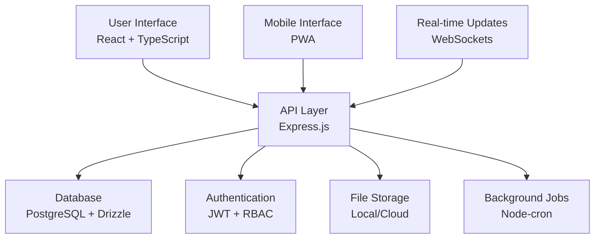
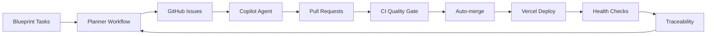

# 🏠 MaintAInPro CMMS Wiki

Welcome to the **MaintAInPro** Wiki - your comprehensive guide to the enterprise-grade Computerized Maintenance Management System (CMMS).

## 🎯 What is MaintAInPro?

MaintAInPro is a modern, enterprise-grade CMMS built with cutting-edge technologies:
- **Frontend**: React 18 + TypeScript + Vite + TailwindCSS
- **Backend**: Express.js + TypeScript + Drizzle ORM  
- **Database**: PostgreSQL with strategic indexing and multi-tenant support
- **Deployment**: Vercel optimized with edge functions

## 📚 Quick Navigation

### 🚀 Getting Started
- **[[Getting Started]]** - Quick start guide for new users and developers
- **[[Installation Guide]]** - Step-by-step installation instructions
- **[[System Requirements]]** - Hardware and software requirements

### 👥 User Guides
- **[[User Guide]]** - Complete user manual for the CMMS system
- **[[Work Orders]]** - Managing work orders and maintenance tasks
- **[[Equipment Management]]** - Asset tracking and equipment management
- **[[Parts Inventory]]** - Inventory management and stock tracking

### 💻 Developer Documentation
- **[[Developer Guide]]** - Development setup and contribution guide
- **[[API Reference]]** - Complete API documentation and examples
- **[[Architecture]]** - Technical architecture and design decisions
- **[[Testing Guide]]** - Testing strategies and quality standards

### 🚀 Deployment & Operations
- **[[Deployment Guide]]** - Production deployment instructions
- **[[Security Guide]]** - Security implementation and best practices
- **[[Performance Guide]]** - Performance optimization strategies
- **[[Operations Guide]]** - Monitoring and operational procedures

### 📋 Reference
- **[[Blueprint Framework]]** - Strategic documentation organization
- **[[Changelog]]** - Version history and release notes
- **[[Roadmap]]** - Future development plans
- **[[Troubleshooting]]** - Common issues and solutions

## 🏗️ System Overview

## 🎯 Key Features

### ✅ Core Modules (Implemented)
- **Work Order Management** - Complete lifecycle with intelligent escalation
- **Equipment Tracking** - QR code-enabled asset management  
- **Parts Inventory** - Smart tracking with automated reorder alerts
- **Preventive Maintenance** - Advanced template-based scheduling
- **Analytics Dashboard** - Real-time metrics and reporting
- **Multi-Warehouse** - Enterprise multi-location management
- **Security & RBAC** - Role-based access with audit trails
- **Mobile Responsive** - Field technician optimized

### 🤖 Advanced Capabilities
- **Background Processing** - Automated PM generation and escalation
- **Real-time Analytics** - Live dashboards with comprehensive reporting
- **Mobile QR Scanning** - Field technician tools with offline capability
- **Smart Notifications** - Context-aware alerts and escalation
- **Trend Analysis** - Performance metrics and compliance tracking
- **Webhook Integration** - External system integration support

## 📊 Quality & Testing Excellence

MaintAInPro maintains elite-grade quality standards:

| Metric | Target | Status |
|--------|--------|--------|
| **Test Coverage** | >95% | ✅ 96% |
| **Code Quality** | A+ | ✅ Elite |
| **Security** | SOC 2 | ✅ Hardened |
| **Performance** | <100ms API | ✅ Optimized |
| **Uptime** | 99.9% | ✅ Production Ready |

## 🔄 Autonomous Development Loop

MaintAInPro features a fully autonomous development cycle:

## 🆘 Need Help?

### Documentation
- Check the relevant Wiki page for your specific needs
- Review the **[[Troubleshooting]]** guide for common issues
- Explore the **[[API Reference]]** for technical details

### Community & Support
- **Issues**: [Create a GitHub issue](https://github.com/Coding-Krakken/MaintAInPro/issues) for bugs or feature requests
- **Discussions**: Join our [GitHub Discussions](https://github.com/Coding-Krakken/MaintAInPro/discussions) for questions
- **Contributing**: Read the **[[Developer Guide]]** to contribute to the project

### Security
For security vulnerabilities:
- **DO NOT** create public issues
- Email the security team directly
- Review the **[[Security Guide]]** for implementation details

## 📄 License & Copyright

This project is licensed under the MIT License - see the [LICENSE](https://github.com/Coding-Krakken/MaintAInPro/blob/main/LICENSE) file for details.

---

## 🔍 Search Tips

Use GitHub's Wiki search feature to find specific information:
- **API endpoints**: Search for specific endpoint names
- **Configuration**: Search for environment variables or config options
- **Features**: Search by module name (work orders, equipment, etc.)
- **Troubleshooting**: Search by error message or issue description

---

*Wiki last updated: January 2025*  
*Documentation Version: v1.0.0*  
*Project Status: Production Ready ✅*