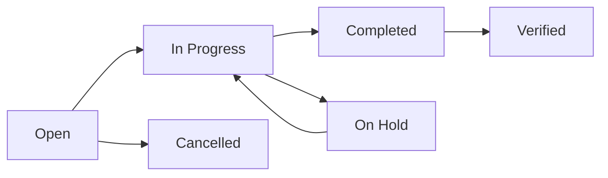

# 👤 User Guide

Complete guide for using MaintAInPro CMMS to manage maintenance operations,
equipment, and inventory.

## 📋 Table of Contents

- [**Getting Started**](#-getting-started)
- [**Dashboard Overview**](#-dashboard-overview)
- [**Work Order Management**](#-work-order-management)
- [**Equipment & Asset Management**](#-equipment--asset-management)
- [**Parts & Inventory**](#-parts--inventory)
- [**Preventive Maintenance**](#-preventive-maintenance)
- [**Reporting & Analytics**](#-reporting--analytics)
- [**Mobile Usage**](#-mobile-usage)
- [**User Management**](#-user-management)
- [**System Settings**](#-system-settings)

## 🚀 Getting Started

### First Login

1. **Access the system** at your organization's MaintAInPro URL
2. **Log in** with your email and password provided by your administrator
3. **Complete your profile** by adding your phone number and preferences
4. **Review the dashboard** to familiarize yourself with the interface

### User Roles Overview

| Role           | Permissions                            | Typical Responsibilities                           |
| -------------- | -------------------------------------- | -------------------------------------------------- |
| **Admin**      | Full system access                     | System configuration, user management, reporting   |
| **Manager**    | View all data, manage work orders      | Work order oversight, resource planning, reporting |
| **Technician** | Assigned work orders, equipment access | Execute maintenance tasks, update work orders      |
| **Requester**  | Create requests, view own submissions  | Submit maintenance requests, track progress        |

### Navigation

The main navigation includes:

- **🏠 Dashboard** - Overview and key metrics
- **🔧 Work Orders** - Maintenance task management
- **⚙️ Equipment** - Asset and equipment management
- **📦 Parts** - Inventory and parts management
- **👥 Users** - User and team management (Admin/Manager only)
- **📊 Reports** - Analytics and reporting
- **⚙️ Settings** - System configuration

## 📊 Dashboard Overview

The dashboard provides a real-time overview of your maintenance operations.

### Key Metrics Cards

**Work Orders Summary**

- Total open work orders
- Overdue tasks requiring attention
- Work orders completed this week
- Average completion time

**Equipment Status**

- Total equipment count
- Equipment requiring maintenance
- Critical equipment alerts
- Equipment availability percentage

**Parts Inventory**

- Low stock alerts
- Parts consumed this month
- Pending orders
- Inventory value

**Team Performance**

- Active technicians
- Work orders per technician
- Completion rate
- Response times

### Quick Actions

From the dashboard, you can quickly:

- **Create new work order** with the "+" button
- **View overdue tasks** by clicking the overdue count
- **Access critical alerts** from the notifications panel
- **Search equipment** using the search bar

### Recent Activity Feed

The activity feed shows:

- Recent work order updates
- Equipment status changes
- Parts transactions
- Team activities

## 🔧 Work Order Management

Work orders are the core of maintenance management in MaintAInPro.

### Creating Work Orders

#### Method 1: Manual Creation

1. Click **"Create Work Order"** button
2. Fill in required information:
   - **Title**: Brief description of the task
   - **Description**: Detailed explanation of the work needed
   - **Priority**: Critical, High, Medium, or Low
   - **Type**: Corrective, Preventive, or Inspection
   - **Equipment**: Select the affected equipment (optional)
   - **Assigned To**: Choose technician(s)
   - **Due Date**: Set completion deadline

3. Add checklist items for detailed tasks
4. Click **"Create Work Order"**

#### Method 2: From Equipment

1. Navigate to **Equipment** section
2. Select the equipment needing maintenance
3. Click **"Create Work Order"** on the equipment page
4. Equipment details are automatically populated

#### Method 3: Mobile QR Scan

1. Use mobile device to scan equipment QR code
2. Select **"Create Work Order"** from equipment menu
3. Fill in details and submit

### Work Order Lifecycle



**Status Definitions:**

- **Open**: Newly created, awaiting assignment or start
- **In Progress**: Technician is actively working on the task
- **On Hold**: Work paused due to missing parts, approval, etc.
- **Completed**: Work finished, awaiting verification
- **Verified**: Work completed and verified by supervisor
- **Cancelled**: Work order cancelled or no longer needed

### Managing Work Orders

#### Viewing Work Orders

**List View:**

- Filter by status, priority, assignee, or equipment
- Sort by due date, priority, or creation date
- Search by work order number or description
- Bulk actions for multiple work orders

**Card View:**

- Visual representation with status colors
- Quick status updates
- Key information at a glance

**Kanban Board:**

- Drag-and-drop status updates
- Visual workflow management
- Team workload overview

#### Updating Work Orders

**For Technicians:**

1. **Start Work**: Change status to "In Progress"
2. **Log Time**: Record start and end times
3. **Update Checklist**: Mark completed tasks
4. **Add Notes**: Document work performed and findings
5. **Attach Photos**: Upload before/after photos
6. **Record Parts Used**: Document consumed parts
7. **Complete Work**: Change status to "Completed"

**For Managers:**

1. **Review Completed Work**: Verify work quality
2. **Approve or Request Changes**: Provide feedback
3. **Close Work Order**: Final approval and closure

#### Time Tracking

Accurate time tracking helps with:

- Labor cost calculation
- Performance analysis
- Future time estimation
- Productivity reporting

**How to log time:**

1. Open the work order
2. Click **"Log Time"**
3. Enter start and end times
4. Add description of work performed
5. Save time entry

### Work Order Checklists

Checklists ensure consistent, thorough work completion.

**Benefits:**

- Standardized procedures
- Quality assurance
- Compliance documentation
- Training tool for new technicians

**Creating Checklists:**

1. Add checklist items when creating work orders
2. Include specific components and actions
3. Mark items as required or optional
4. Add notes and instructions

**Using Checklists:**

1. Review all items before starting work
2. Check off completed items progressively
3. Add notes for any deviations or findings
4. Attach photos for evidence when required

## ⚙️ Equipment & Asset Management

Effective equipment management is crucial for maintenance planning and
execution.

### Equipment Hierarchy

MaintAInPro supports hierarchical equipment organization:

```
Facility
├── Production Line A
│   ├── Conveyor System
│   │   ├── Motor
│   │   ├── Belt
│   │   └── Control Panel
│   └── Packaging Machine
└── Utilities
    ├── Air Compressor
    └── HVAC System
```

### Equipment Information

Each equipment record includes:

**Basic Information:**

- Asset tag (unique identifier)
- Equipment number
- Description
- Manufacturer and model
- Serial number
- Installation date
- Warranty information

**Location & Status:**

- Physical location/area
- Current status (Active, Maintenance, Decommissioned)
- Criticality level (Critical, High, Medium, Low)
- Parent/child relationships

**Technical Details:**

- Specifications
- Operating parameters
- Safety information
- Documentation links

### Adding Equipment

1. Navigate to **Equipment** section
2. Click **"Add Equipment"**
3. Fill in required information:
   - **Asset Tag**: Unique identifier (auto-generated if desired)
   - **Description**: Clear, descriptive name
   - **Manufacturer**: Equipment manufacturer
   - **Model**: Model number
   - **Serial Number**: Manufacturer's serial number
   - **Location**: Physical location
   - **Criticality**: Impact level if equipment fails

4. Optionally add:
   - Parent equipment (for hierarchy)
   - Installation date
   - Warranty expiry
   - Technical specifications

5. Click **"Save Equipment"**

### QR Code Management

Each equipment automatically gets a QR code for easy mobile access.

**Using QR Codes:**

1. **Generate**: QR codes are automatically created
2. **Print**: Download and print QR code labels
3. **Attach**: Place labels on physical equipment
4. **Scan**: Use mobile device to access equipment information

**QR Code Benefits:**

- Instant equipment identification
- Quick work order creation
- Mobile-friendly equipment access
- Efficient field technician workflows

### Equipment Maintenance History

Track all maintenance activities for each piece of equipment:

**History Includes:**

- All work orders (completed and ongoing)
- Preventive maintenance schedules
- Parts consumed
- Total maintenance costs
- Downtime tracking
- Performance trends

**Viewing History:**

1. Open equipment record
2. Click **"Maintenance History"** tab
3. Filter by date range or work order type
4. Export history for reporting

### Equipment Status Management

**Status Types:**

- **Active**: Equipment is operational and available
- **Maintenance**: Equipment is under maintenance
- **Decommissioned**: Equipment is no longer in service
- **Retired**: Equipment has reached end of life

**Changing Status:**

1. Open equipment record
2. Click **"Change Status"**
3. Select new status
4. Add reason for change
5. Save status update

## 📦 Parts & Inventory

Efficient parts management ensures maintenance work can be completed without
delays.

### Parts Catalog

The parts catalog includes:

**Part Information:**

- Part number (unique identifier)
- Description
- Category (Bearings, Seals, Filters, etc.)
- Manufacturer and supplier
- Unit cost
- Lead time for ordering

**Stock Information:**

- Current quantity on hand
- Location (bin/shelf location)
- Minimum stock level
- Maximum stock level
- Reorder point

### Adding Parts

1. Navigate to **Parts** section
2. Click **"Add Part"**
3. Enter part details:
   - **Part Number**: Unique identifier
   - **Description**: Clear part description
   - **Category**: Select appropriate category
   - **Supplier**: Primary supplier
   - **Unit Cost**: Cost per unit
   - **Location**: Storage location

4. Set stock levels:
   - **Current Quantity**: Current stock
   - **Minimum Level**: Reorder threshold
   - **Maximum Level**: Maximum stock to maintain

5. Click **"Save Part"**

### Stock Management

#### Receiving Stock

When new parts arrive:

1. Find the part in inventory
2. Click **"Receive Stock"**
3. Enter quantity received
4. Add purchase order reference
5. Update unit cost if changed
6. Save transaction

#### Consuming Parts

When parts are used in maintenance:

1. **From Work Order**: Parts can be consumed directly from work order
2. **Manual Consumption**:
   - Find part in inventory
   - Click **"Consume"**
   - Enter quantity used
   - Reference work order or reason
   - Save transaction

#### Adjustments

For corrections or cycle counts:

1. Find the part
2. Click **"Adjust Stock"**
3. Enter new quantity
4. Provide reason for adjustment
5. Save adjustment

### Low Stock Alerts

The system automatically alerts when parts fall below minimum levels:

**Alert Types:**

- Dashboard notifications
- Email alerts (if configured)
- Reports showing low stock items

**Managing Alerts:**

1. Review low stock dashboard
2. Determine reorder quantities
3. Create purchase orders
4. Update expected delivery dates

### Parts Reporting

Track parts usage and costs:

**Reports Available:**

- Parts consumption by period
- Stock levels and movements
- Costs by category or equipment
- Supplier performance
- Parts forecast based on usage

## 🔄 Preventive Maintenance

Preventive maintenance helps avoid unexpected failures and extends equipment
life.

### PM Schedule Types

**Time-Based:**

- Daily, weekly, monthly, quarterly, yearly
- Specific calendar dates
- Custom intervals

**Usage-Based:**

- Operating hours
- Cycles or production counts
- Distance (for vehicles)

**Condition-Based:**

- Sensor readings
- Visual inspection results
- Performance parameters

### Creating PM Schedules

1. Navigate to equipment record
2. Click **"Preventive Maintenance"** tab
3. Click **"Add PM Schedule"**
4. Configure schedule:
   - **Frequency**: How often to perform
   - **Start Date**: When to begin schedule
   - **Work Order Template**: Standard tasks to perform
   - **Lead Time**: How far in advance to create work orders
   - **Assigned To**: Default technician or team

5. Save PM schedule

### PM Work Order Generation

The system automatically creates work orders based on PM schedules:

**Generation Process:**

- System checks schedules daily
- Creates work orders based on lead time
- Assigns to designated technicians
- Includes standard checklist items
- Sets appropriate due dates

**Manual Generation:**

- Generate PM work orders on demand
- Override automatic scheduling
- Create one-time PM work orders

### PM Performance Tracking

Monitor PM program effectiveness:

**Key Metrics:**

- PM completion rate
- Schedule compliance
- PM vs. corrective work ratio
- Equipment reliability trends
- Cost per PM activity

## 📊 Reporting & Analytics

Make data-driven maintenance decisions with comprehensive reporting.

### Dashboard Analytics

**Real-Time Metrics:**

- Work order status summary
- Equipment performance indicators
- Parts inventory status
- Team productivity measures

**Trend Analysis:**

- Work order volume trends
- Completion time trends
- Cost trends
- Equipment reliability

### Standard Reports

#### Work Order Reports

**Completion Report:**

- Work orders completed by period
- Average completion time
- On-time completion percentage
- Backlog analysis

**Cost Report:**

- Labor costs by technician
- Parts costs by equipment
- Total maintenance costs
- Budget vs. actual spending

**Performance Report:**

- Technician productivity
- Equipment downtime
- Response times
- Customer satisfaction

#### Equipment Reports

**Reliability Report:**

- Mean time between failures (MTBF)
- Mean time to repair (MTTR)
- Equipment availability
- Failure analysis

**Maintenance History:**

- All maintenance activities
- Costs by equipment
- Parts consumption
- Trend analysis

#### Parts Reports

**Inventory Report:**

- Current stock levels
- Stock movements
- Low stock items
- Inventory value

**Usage Report:**

- Parts consumption by period
- High-usage items
- Cost analysis
- Supplier performance

### Custom Reports

Create custom reports for specific needs:

1. Click **"Create Custom Report"**
2. Select data sources (work orders, equipment, parts)
3. Choose fields to include
4. Set filters and criteria
5. Select chart types
6. Save and schedule report

### Exporting Data

Export reports in multiple formats:

- **PDF**: For printing and sharing
- **Excel**: For further analysis
- **CSV**: For data import to other systems
- **Email**: Scheduled delivery to stakeholders

## 📱 Mobile Usage

MaintAInPro is optimized for mobile devices to support field technicians.

### Mobile Features

**Offline Support:**

- Download work orders for offline access
- Record work performed without internet
- Sync data when connection is restored

**QR Code Scanning:**

- Scan equipment QR codes
- Instant access to equipment information
- Create work orders from equipment scan

**Photo Capture:**

- Take before/after photos
- Attach to work orders automatically
- Document work progress

### Mobile Workflow

#### Starting Work

1. **Access work orders** from mobile dashboard
2. **Select assigned work order**
3. **Review details and checklist**
4. **Start timer** for time tracking
5. **Begin work**

#### During Work

1. **Update checklist items** as completed
2. **Take photos** of work in progress
3. **Add notes** about findings or issues
4. **Record parts used**
5. **Log any additional time**

#### Completing Work

1. **Review checklist** for completion
2. **Take final photos**
3. **Add completion notes**
4. **Stop timer**
5. **Change status to completed**
6. **Sync data** when online

### Mobile Best Practices

**Preparation:**

- Download work orders before going offline
- Ensure device is charged
- Have backup power source for long jobs

**During Work:**

- Take clear, well-lit photos
- Add detailed notes while fresh in memory
- Update status regularly
- Save work frequently

**After Work:**

- Sync data as soon as possible
- Review work order for completeness
- Follow up on any issues found

## 👥 User Management

Administrators can manage users, roles, and permissions.

### User Roles

#### Admin

**Permissions:**

- Full system access
- User management
- System configuration
- All reports and analytics
- Data export capabilities

**Responsibilities:**

- System setup and maintenance
- User onboarding and training
- Data backup and security
- System monitoring

#### Manager

**Permissions:**

- View all work orders and equipment
- Create and assign work orders
- Approve completed work
- Access reports and analytics
- Manage parts inventory

**Responsibilities:**

- Work order oversight and planning
- Resource allocation
- Performance monitoring
- Reporting to leadership

#### Technician

**Permissions:**

- View assigned work orders
- Update work order status
- Access equipment information
- Record time and parts usage
- Upload photos and documents

**Responsibilities:**

- Execute maintenance tasks
- Provide accurate updates
- Follow safety procedures
- Document work performed

#### Requester

**Permissions:**

- Create maintenance requests
- View own submissions
- Track request progress
- Basic equipment lookup

**Responsibilities:**

- Submit clear, detailed requests
- Provide accurate information
- Follow up as needed

### Adding Users

1. Navigate to **Users** section (Admin only)
2. Click **"Add User"**
3. Enter user information:
   - **Email**: User's email address
   - **First Name**: User's first name
   - **Last Name**: User's last name
   - **Role**: Select appropriate role
   - **Phone**: Contact phone number

4. Set user permissions if needed
5. Click **"Send Invitation"**
6. User receives email to set password

### Managing User Access

**Activating/Deactivating Users:**

- Deactivate users who no longer need access
- Reactivate users returning to work
- Maintain audit trail of access changes

**Password Management:**

- Users can reset their own passwords
- Admins can force password resets
- Set password complexity requirements

**Session Management:**

- Monitor active user sessions
- Force logout for security reasons
- Set session timeout periods

## ⚙️ System Settings

Configure MaintAInPro to match your organization's needs.

### Organization Settings

**Basic Information:**

- Organization name
- Address and contact information
- Logo and branding
- Time zone settings

**Work Order Configuration:**

- Work order numbering format
- Default priorities and types
- Status workflow customization
- Approval requirements

**Equipment Configuration:**

- Asset tag format
- Equipment categories
- Criticality levels
- Custom fields

### Notification Settings

**Email Notifications:**

- Work order assignments
- Due date reminders
- Overdue alerts
- Completion notifications

**System Notifications:**

- In-app alerts
- Dashboard notifications
- Mobile push notifications
- Low stock alerts

### Integration Settings

**External Systems:**

- ERP system connections
- SCADA system integration
- Asset management systems
- Procurement systems

**API Configuration:**

- Webhook endpoints
- API key management
- Rate limiting settings
- Security configurations

### Backup and Security

**Data Backup:**

- Automated backup schedules
- Backup retention policies
- Disaster recovery procedures
- Data export capabilities

**Security Settings:**

- Password policies
- Two-factor authentication
- Session timeout
- Access logging

## 🆘 Getting Help

### In-App Help

- **Tooltips**: Hover over fields for quick explanations
- **Help Center**: Searchable help articles
- **Video Tutorials**: Step-by-step guides
- **Feature Tours**: Interactive walkthroughs

### Documentation

- **[[Getting Started]]** - Quick start guide
- **[[API Reference]]** - Technical integration guide
- **[[Troubleshooting]]** - Common issues and solutions

### Support Channels

- **Help Desk**: Submit support tickets for technical issues
- **Community Forum**: Connect with other users
- **Training Sessions**: Schedule custom training
- **User Groups**: Join local user communities

### Best Practices

**Work Order Management:**

- Create clear, specific work order titles
- Include detailed descriptions
- Set realistic due dates
- Assign appropriate priority levels

**Equipment Management:**

- Use consistent naming conventions
- Keep equipment information current
- Regularly update maintenance history
- Plan preventive maintenance schedules

**Parts Management:**

- Maintain accurate stock levels
- Set appropriate reorder points
- Track parts consumption accurately
- Regular inventory audits

**Team Coordination:**

- Communicate status changes promptly
- Document work thoroughly
- Share knowledge and best practices
- Provide feedback for system improvements

---

## 🎉 Success with MaintAInPro

Following this user guide will help you maximize the benefits of MaintAInPro:

- **Reduced Downtime**: Proactive maintenance planning
- **Improved Efficiency**: Streamlined workflows and mobile access
- **Better Visibility**: Real-time monitoring and reporting
- **Cost Control**: Accurate tracking and analysis
- **Compliance**: Documentation and audit trails

**Remember**: The key to success is consistent, accurate data entry and active
use of the system's features.

---

_User Guide last updated: January 2025_
