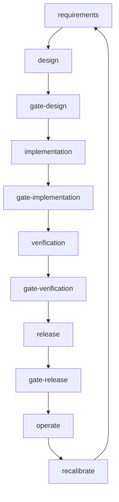

# MaintAInPro Architecture

## Overview
MaintAInPro uses a modular architecture with PostgreSQL, Express.js, React, and Drizzle ORM. The process graph defines workflow phases and gates for quality, security, and compliance.

## Workflow
- Requirements → Design → Implementation → Verification → Release → Operate → Recalibrate
- Gates enforce evidence and criteria at each phase

## Key Modules
- Work Order Management
- Preventive Maintenance
- Equipment Asset Management
- Parts Inventory
- Vendor/Contractor Management
- System Configuration

## Process Graph & Gates
- See .process/graph.yaml for workflow definition
- See .process/policies/ for gate and recalibration rules

## Evidence & Automation
- CI scripts validate process graph and gate evidence
- Mermaid diagrams document workflow

## References
- ADRs, RFCs, and postmortems in /artifacts/

---

### Mermaid Diagram (Autogenerated)

